# Table of content.

This lab walks covers how to create GDC clusters in both L2 (bundled LB with metallb) and L3 (bundled LB with BGP) modes and shed some light on the internal workings clusters deployment and connectivity.

The first part of the lab however has the student goes through the critical step of creating infrastructure for the servers that GDC is to be deployed using a networking appliance that simulates the network fabric of an on-premises data center. 

Part I of the lab is about preparing the virtual datacenter fabric.
Part II has the student deploy the GCP fleet project that GDC cluster will register to.
Part III covers the deployment of two types of GDC clusters: An admin cluster, a user cluster using bundled LB in L2 mode (metallb) and one user cluster using bundled LB in L3 mode (BGP)


- [Table of content.](app://obsidian.md/index.html#Table%20of%20content.)
- [Introduction](app://obsidian.md/index.html#Introduction)
    - [i.1 Project Purpose](app://obsidian.md/index.html#i.1%20Project%20Purpose)
    - [i.2 Repository Content](app://obsidian.md/index.html#i.2%20Repository%20Content)
    - [i.3 Use Cases](app://obsidian.md/index.html#i.3%20Use%20Cases)
    - [i.4 pnetlab vDC Networking Appliance](app://obsidian.md/index.html#i.4%20pnetlab%20vDC%20Networking%20Appliance)
- [Part I](app://obsidian.md/index.html#Part%20I)
- [Task 1: Fabric setup: pnetlab & jump host](app://obsidian.md/index.html#Task%201:%20Fabric%20setup:%20pnetlab%20&%20jump%20host)
    - [1.1 main.sh & Terraform Configuration file](app://obsidian.md/index.html#1.1%20main.sh%20&%20Terraform%20Configuration%20file)
    - [1.2 windows jumphost](app://obsidian.md/index.html#1.2%20windows%20jumphost)
    - [1.3 Port forward to Interface](app://obsidian.md/index.html#1.3%20Port%20forward%20to%20Interface)
    - [1.4 Validate lab devices connectivity](app://obsidian.md/index.html#1.4%20Validate%20lab%20devices%20connectivity)
    - [1.5 A note about vyos configs](app://obsidian.md/index.html#1.5%20A%20note%20about%20vyos%20configs)
    - [1.6 pnetlab Server internals (optional)](app://obsidian.md/index.html#1.6%20pnetlab%20Server%20internals%20\(optional\))
- [Task 2: Servers Deployment](app://obsidian.md/index.html#Task%202:%20Servers%20Deployment)
    - [2.1 Terraform Deployment](app://obsidian.md/index.html#2.1%20Terraform%20Deployment)
    - [2.2 Validate Connectivity](app://obsidian.md/index.html#2.2%20Validate%20Connectivity)
    - [2.3 Update logical topology](app://obsidian.md/index.html#2.3%20Update%20logical%20topology)
- [Part II](app://obsidian.md/index.html#Part%20II)
- [Task 3: GDC-BM Fleet hub project](app://obsidian.md/index.html#Task%203:%20GDC-BM%20Fleet%20hub%20project)
    - [3.1 Terraform Configuration file](app://obsidian.md/index.html#3.1%20Terraform%20Configuration%20file)
    - [3.2 Roles, APIs, Service Accounts](app://obsidian.md/index.html#3.2%20Roles,%20APIs,%20Service%20Accounts)
- [Task 4: GDC Clusters Deployment](app://obsidian.md/index.html#Task%204:%20GDC%20Clusters%20Deployment)
    - [4.1 Workstation Appliance](app://obsidian.md/index.html#4.1%20Workstation%20Appliance)
    - [4.2 Admin cluster](app://obsidian.md/index.html#4.2%20Admin%20cluster)
    - [4.3 User cluster 1 (L2)](app://obsidian.md/index.html#4.3%20User%20cluster%201%20\(L2\))
    - [4.4 User cluster 2 (L3)](app://obsidian.md/index.html#4.4%20User%20cluster%202%20\(L3\))
- [Task 5: OnPrem API](app://obsidian.md/index.html#Task%205:%20OnPrem%20API)
    - [Fleet Project Requirements](app://obsidian.md/index.html#Fleet%20Project%20Requirements)
    - [Cluster Details](app://obsidian.md/index.html#Cluster%20Details)
    - [OnPrem API for Cluster Operations](app://obsidian.md/index.html#OnPrem%20API%20for%20Cluster%20Operations)
    - [Enroll clusters](app://obsidian.md/index.html#Enroll%20clusters)
    - [Create Enrolled clusters with bmctl](app://obsidian.md/index.html#Create%20Enrolled%20clusters%20with%20bmctl)
    - [Create cluster using GKE On-prem API clients](app://obsidian.md/index.html#Create%20cluster%20using%20GKE%20On-prem%20API%20clients)


# Introduction


## i.1 Project Purpose

This lab builds creates a comprehensive virtual networking and datacenter infrastructure simulation environment on Google Cloud Platform for the purpose of experimenting with GDC s/o solutions as as well as other hybrid cloud networking use cases. This current project automates the deployment of:

1. A **Network-appliance-based Datacenter fabric** (GCE on a vdc-X project) - In this lab we use a KVM-based network simulation platform called pnetlab to set up a datacenter network topology. This is deployed via a GCE instance in project 'vdc-X'.
2. **Virtual Server Infrastructure (GCEs on vdc-X project)** - Simulating physical data center servers across multiple racks for the purpose of running GDC s/o on.
3. A Fleet host project (gdc-X) for the GDC cluster to register to.
4. **Google Distributed Cloud (GDC) s/o Bare Metal clusters: 1 admin cluster managing 2 users cluster, 1 with bundled Load balancing in L2 mode and 1 with bundled load balancing with BGP.

The purpose of this is 3-fold:
- Provide a virtual  data center emulation environment akin to what customers run  on-premises to help customers relate to how oru solutions integrate with their on-premises infrastructure.
- Provide Google CEs, PSO, and Engineering an environment that they can use to learn, test, demo GDC with.
- Provide an experimentation sandbox for other GDC and hybrid cloud use cases.


## i.2 Repository Content

The repo is located at:
```
https://gitlab.com/ymeillier/vdc-lab-user
```


The complete tree structure is provided in the [README.md](../../README.md) of the git repo.  
The below trimmed version of the project emphasizes the key elements of the repo:

```
vdc-lab-user/
├── main.sh                          # vDC setup setup pre-reqs
├── main.tf                          # Core vDC infrastructure deployment
├── terraform.tfvars                 # Variables for vDC infrastructure
├── variables.tf                     # Variable definitions
| 
├── gdc-gcp-project/tf/              # GDC Fleet Project Deployment
│   ├── main-gdc.tf                  # GDC project creation & service accounts
│   └── terraform-gdc.auto.tfvars    # GDC-specific variables
| 
├── servers/tf/                      # Server Infrastructure Deployment
│   ├── main-servers.tf              # Server deployment logic
│   ├── terraform-servers.auto.tfvars # Server configuration list
| 
├── manifests/                       # GDC manifests
│ ├── abm10-adm01.yaml # Anthos Bare Metal admin cluster configuration
│ ├── abm11-user1.yaml # Anthos Bare Metal user1 cluster configuration
│ └── abm12-user2.yaml # Anthos Bare Metal user2 cluster configuration

```


The three key scripts/tf files are:
- The main.sh bash script
- main.tf
- main-gdc.tf
- main-servers.tf and its configuration file terraform-servers..auto.tfvars

### 1. **main.sh** - Prerequisites & Setup Automation

main.sh is a bash script used to establish key variables for terraform deployments of the infrastructure (project IDs, user, project billing information, services,...). The execution of main.sh can be interrupted at any point in time and restarted if needed. 


- **Purpose**: Automates all prerequisite setup before Terraform deployment
- **Key Functions**:
  - User authentication and project creation
  - GCP API enablement and IAM role assignment
  - Organization policy configuration
  - Storage bucket creation and asset cloning
  - Custom image import for PNetLab
  - Chrome Remote Desktop setup for Windows jump host
  - Terraform initialization

### 2. **main.tf** - Core vDC Infrastructure

main.tf is the terraform file created the vdc-X project that the virtual datacenter infrastructure resides on. It is run automatically at the end of main.sh. It also deploys a window jump host deployed in powered off state as its use is optional.The variables terraform.tfvars are preconfigured for you by main.sh.

- **Purpose**: Deploys the foundational virtual data center infrastructure
- **Key Resources**:
  - **8 VPC networks** simulating different network segments (management, underlay, overlay, WAN)
  - **100+ subnets** organized by rack topology (service rack, border rack, racks 1-4)
  - **PNetLab server** with 8 network interfaces for network simulation
  - **Windows jump host** with Chrome Remote Desktop access
  - **Cloud NAT gateways** for internet connectivity
  - **Firewall rules** and **organization policies**

### 3. **main-gdc.tf** - GDC Fleet Project

Next is main-gdc.tf for deploying the GCP fleet host project for GDC cluster to register to. This is run manually with a terraform apply and its tfvars values are pre-configured for you from main.sh.
- **Purpose**: Creates a separate GCP project for Google Distributed Cloud deployments
- **Key Resources**:
  - **New GCP project** with proper billing and folder structure
  - **Service accounts** for Anthos Bare Metal (gcr, connect, register, cloud-ops)
  - **IAM roles and permissions** for GDC operations
  - **Service account keys** for cluster authentication
  - **Organization policies** to allow service account key creation

### 4. **main-servers.tf & terraform-servers.auto.tfvars** - Server Deployment

Lastly, main-server.tf and its related .tfvars file terraform-servers.auto.tfvars is the what is used to deploy compute servers in our virtual datacenter. You will edit its .tfvars to choose what nodes to setup for a particular exercise and will deploy those servers via a terraform apply on main-servers.tf


- **Purpose**: Deploys virtual servers simulating physical data center infrastructure
- **Key Features**:
  - **Flexible server naming convention**: `cluster-prefix-node-type-rack-overlay-net-ip-stack-machine-type`
  - **Multi-rack topology**: Servers distributed across service rack (rs), border rack (r0), and racks 1-4
  - **VXLAN networking**: Automated overlay network configuration
  - **Role-specific configuration**: Workstations, control plane nodes, worker nodes, BGP servers
  - **Generated scripts**: Custom startup scripts for each server type

### Network Architecture

The lab simulates a realistic spone/leaf (Clos) data center network topology:

- **Management Network (VPC1)**: 10.10.x.0/24 - Server management interfaces
- **Underlay Network (VPC4/VPC5)**: 10.40.x.0/24, 10.50.x.0/24 - VXLAN tunnel endpoints
- **Overlay Networks**: 10.101.x.0/24, 10.102.x.0/24, etc. - Application traffic
- **WAN/internet Networks (VPC7/VPC8)**: For external connectivity and VPN testing

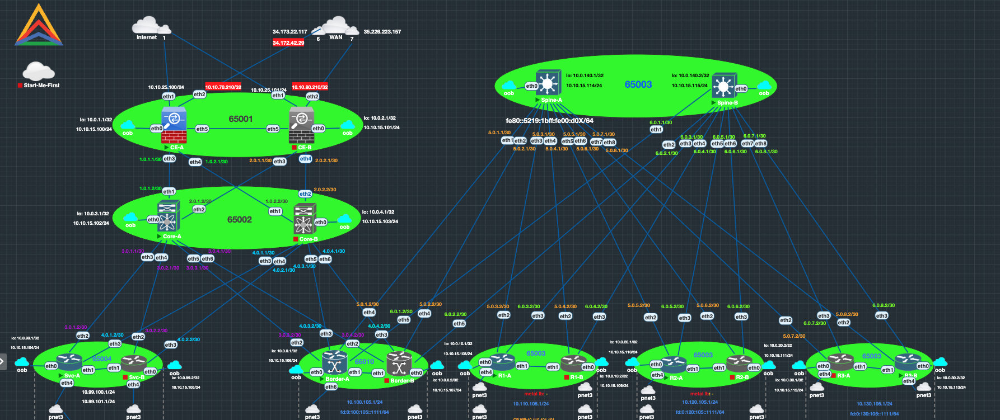
- Two Edge Routers: CE-A and CE-B - For simplicity prposes, only CE-A is configured and to be powered on
- Two Core Routers: Core-A (& Core-B) - As with the CE routes, only Core-A is to be powered on.
- Service Rack Top of Rack switches: Svc-A (&Svc-B)
- Border Rack TORs Border-A (& Border-B)
- 3 compute racks each with a pair of TORs: R1-A, R2-A and R3-B. (Note that in R3, R3-B is the one to be powered on)
- Two Spine Switches: Spine-A & Spine-B - Both should be powered on.

South of the TORs are the servers. These are GCE instances connecting to our network topology over vxlan-overlays. 

The only compute server running natively in the network appliance is the `win-DC` node, a windows server node acting as our central DNS server.


### Deployment Workflow

1. **Run main.sh**: Sets up prerequisites, authentication, and base infrastructure
2. **Deploy main.tf**: Creates core vDC infrastructure including PNetLab
3. **Deploy gdc-gcp-project/tf/**: Creates GDC fleet project (optional)
4. **Deploy servers/tf/**: Deploys virtual servers for testing (optional)

At this point click [here](app://obsidian.md/index.html#Task%201:%20Fabric%20setup:%20pnetlab%20&%20jump%20host)here to skip to Task 1 to start the infrastructure deployment process. There are two steps of the deployment process that will take 10-15 minutes each: the creation of the compute image and the deployment of the vdc project. You can go back to this during your down time.


## i.4 pnetlab vDC Networking Appliance

### i.4.1 network emulators  , eve-ng, GNS3 ...
containerlab, Cisco packet tracer, Cisco Modeling lab,....


**Network emulators** for labbing are software platforms that create a **virtualized network environment** by running the **actual operating system binaries** of network devices (like Cisco IOS, Junos, or Linux). This allows engineers and students to build, configure, and test complex network topologies with a high degree of fidelity, essentially behaving like real hardware.

They are the preferred tool for **CCNP and CCIE-level** lab work because they provide the most realistic, command-for-command experience.

| **Emulator**                                                | **Best For**                                                            | **Key Features**                                                                                                                                                    | **Cost Model**                                    |
| ----------------------------------------------------------- | ----------------------------------------------------------------------- | ------------------------------------------------------------------------------------------------------------------------------------------------------------------- | ------------------------------------------------- |
| **EVE-NG** (Emulated Virtual Environment - Next Generation) | Multi-vendor, large-scale labs, enterprise-grade setups.                | **Clientless** (runs in a web browser), multi-vendor support, robust memory/CPU management.                                                                         | Free (Community) / Paid (Pro)                     |
| **GNS3** (Graphical Network Simulator 3)                    | Flexibility, advanced users, integrating with local VMs and containers. | **Open-source, highly flexible**, can integrate with local hypervisors (VirtualBox, VMware) and sniff traffic with Wireshark.                                       | Free                                              |
| **Cisco Modeling Labs (CML)**                               | Cisco-centric, high-fidelity, and certification focus (CCNP/CCIE).      | **Official Cisco platform**, includes legally licensed Cisco images (IOSv, NX-OSv, etc.), excellent for automation.                                                 | Paid (Personal Editions)                          |
| **Containerlab**                                            | DevOps, Network Automation, CI/CD pipelines.                            | **Lightweight and fast** (uses containers instead of VMs), configuration is done via a declarative file (YAML), ideal for modern NOS (Nokia SR Linux, Arista cEOS). | Free (Open-Source)                                |
| pnetlab                                                     | Multi-vendor, large-scale labs, enterprise-grade setups.                | **Clientless** (runs in a web browser), multi-vendor support, robust memory/CPU management.                                                                         | Free (fork of eve-ng community plus improvements) |

### i.4.2 pnetlab GUI
### i.4.3 KVM Server

The appliance is kvm under the hood.

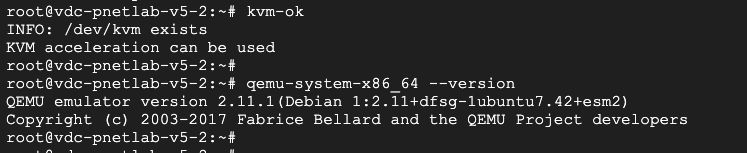


Before any node of the topology is started we can validate that no qemu process is running.

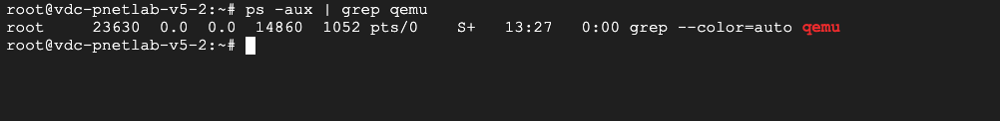
after starting the dummy yellow cloud node:
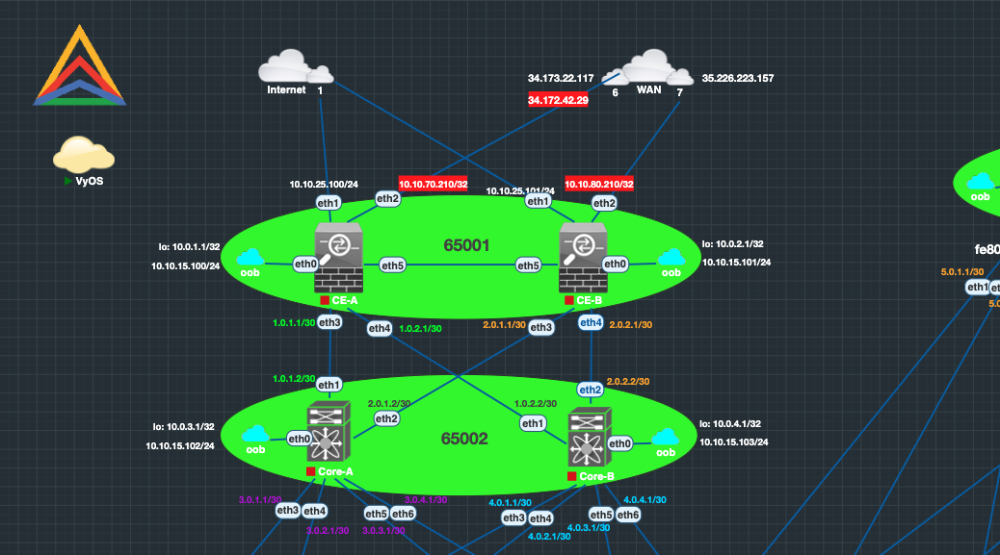


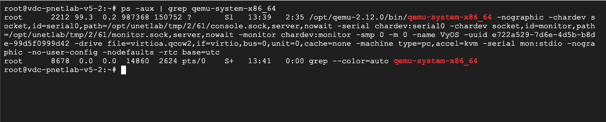
It shows the flags used when launching the qemu process such as `-name`.
The qemu options under node settings are where such options can be set:
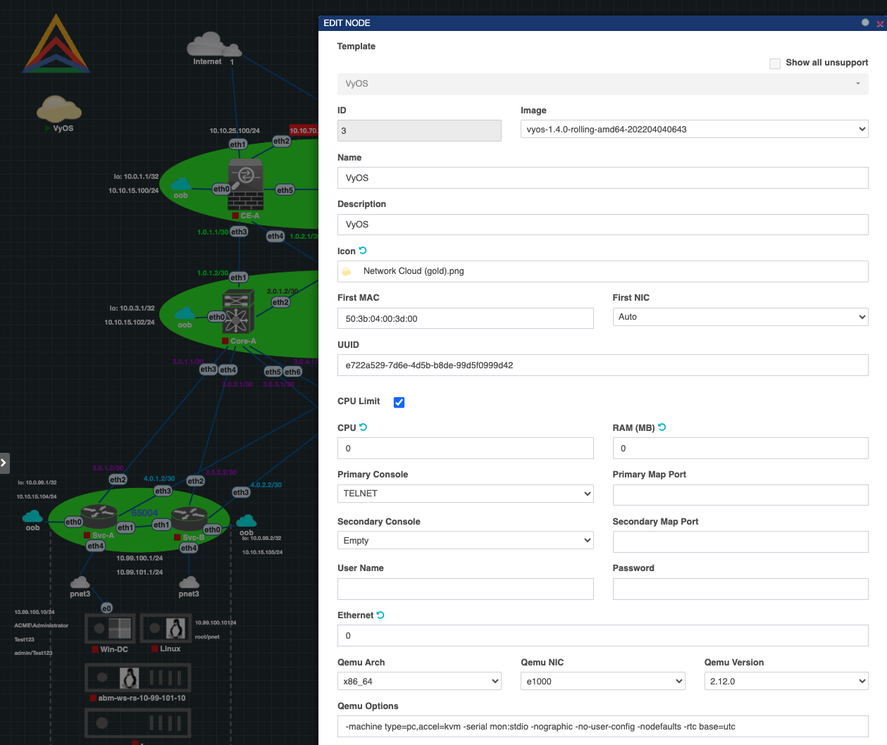


### i.4.4 vyos routers

Each swith/router in our networking fabric are using Vyatta vyos. 


you can access the router terminal by single clicking on the running node (do not double click). For example in the below picture we logged in to the CE-A router and we are displaying the interfaces as well testing connectivity  to our winDC server:


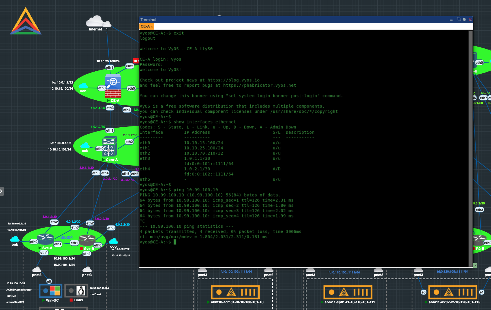

Note: the user space ping command does not allow some of the common flags of the ping commands (could be the case for other commands too). Here ping -c 3 would not work but you can run the command as root:


you can obviously reboot the routers if needed. Configurations will not be lost across reboots.


### i.4.5 winDC (qemu node)

### i.4.6 Template lab 

A reference virtual fabric was created for the purpose of this lab for you to leverage as is. Below is a full view of the physical topology:

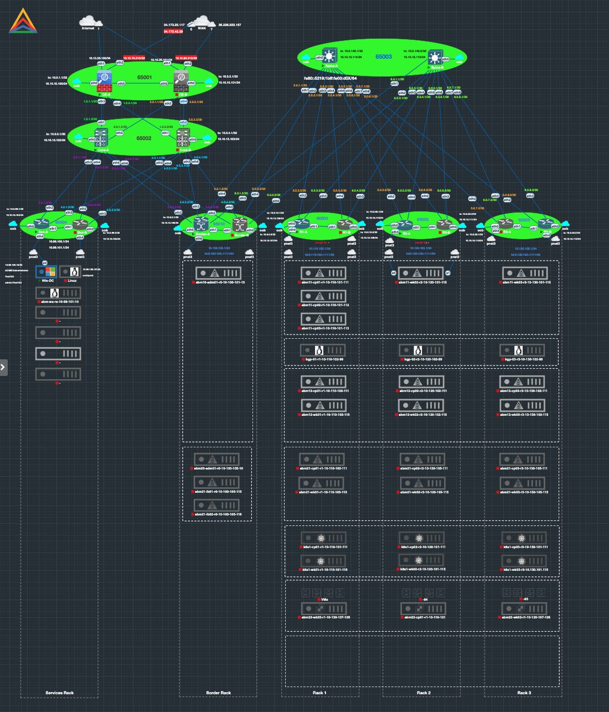

The use case is for a somewhat large scale enterprise datacenter fabric with a routed spine/leaf fabric connecting 5 compute racks: a Services Rack, a Border Rack, and 3 compute* racks  (Rack1, Rack2, Rack3). (*servers ued for compute can be deployed in any rack)

The networking fabric contains a pair of Top of Rack (TOR) routers for each rack markind the L2/L3 demarcation boundary (L2 domain vs routed domain). 
A pair of Spine switches are used to interconnect the compute racks between each other.  and the border rack while a pair of Routers are deployed for our core (Core-A & Core-B) and a pair of of Edge routers (CE-A & CE-B) are deployed for our WAN & Internet connectivity


### i.4.7 Integration with GCP workloads
e.g to use for GDC Bare metal ....


# Part I

# Task 1: Fabric setup: pnetlab & jump host


## 1.1 main.sh & Terraform Configuration file

### Clone repo

While in the folder of your choice:
```
git clone https://gitlab.com/ymeillier/vdc-lab-user.git ./
```

### Ask to for User Whitelisting

A number of assets will be cloned to a local storage bucket during deployment of the lab. In order to clone these assets to your bucket, your user and Google Workspace ID needs to be whitelisted.

Contact Yannick Meillier for getting access providing the following information:

1/ you google cloud admin user. On argolis (CE GCP environment). this typically is admin@XXXX.altostrat.com

2/ Provide your Argolis/Cloud Google Workspace ID (GWID)

 - Sign in to the Google Admin console at admin.google.com (as your cloud user).
 - Navigate to the Menu: Account > Account settings > Profile.
- Look for the Customer ID field. This is your organization's unique GWCID.

### IAM roles

#### Required roles (TBD):
The account used when authenticated to gcloud for the deployment of the lab assets requires a number of permissions that you might have not have granted yourself. Please ensure that your account has the following roles:


- org policy admin: `roles/orgpolicy.policyAdmin`
	- for the user to overwrite argolis default org policies preventing, for example, the creation of service account keys, enable allocation of external IPs to GCE instances,....

You probably already have the below roles:
- org admin (should be org admin already): `roles/resourcemanager.organizationAdmin` 

- billing admin  (project level) - as project owner you should have bill admin permission. If running into issues assigning the billing ID to your project make sure to add the role `roles/billing.projectManager`   

- folder admin at the Org level (`roles/resourcemanager.folderAdmin`)


Other roles will be assigned on the project via main.sh.

#### To apply roles:


At org level:
```
ORG_ID=10xxxxxxxx493
USER=admin@xyz.altostrat.com
gcloud organizations add-iam-policy-binding $ORG_ID \
--member="user:${USER}" \
--role="roles/orgpolicy.policyAdmin"
```

at folder (if needed, just providing syntax of the command):
```
## Assign Roles to User:
FOLDER_ID=$ID_FOLDER_GDCV
USER=$USER
gcloud resource-manager folders add-iam-policy-binding $FOLDER_ID \
--member="user:${USER}" \
--role="roles/owner"

```


#### Check Roles

##### At Org level
To check your assigned roles at org level:
```
ORG_ID=106xxxxxxx493
USER=anthos-admin@meillier.altostrat.com

gcloud organizations get-iam-policy $ORG_ID \
--flatten bindings[].members \
--filter bindings.members:user:$USER \
--format="table[box](bindings.role,bindings.members)"
```

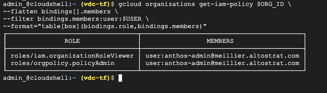


##### At project level:


```
gcloud projects get-iam-policy $PROJECT \
--flatten bindings[].members \
--filter bindings.members:user:$USER \
--format="table[box](bindings.role,bindings.members)"
```

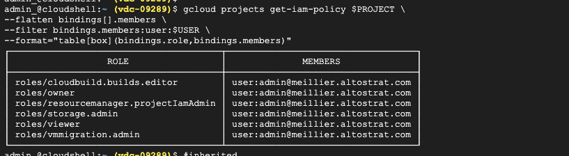

##### At project inherited:


```
gcloud projects get-ancestors-iam-policy $PROJECT \
--flatten policy.bindings[].members \
--filter policy.bindings.members:user:$USER \
--format="table[box](policy.bindings.role,policy.bindings.members,id)"
```


### Auto-shutdown policies
The lab will be deployed with an auto-shutdown policy set on each server deployed to GCP so as to prevent unexpected spend. These GCE instances, particularly the pnetlab server are beefy and rack up spend pretty fast.
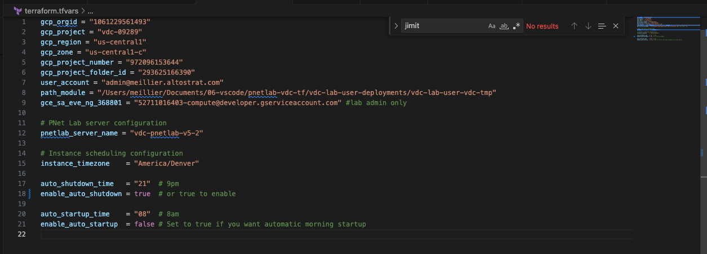
Servers are set to shut down at 9pm MST which you can change. You can also set auto-starts (or start manually via the console or terraform apply).

### main.sh

run main.sh and follow the prompts:

```
./main.sh
```

This will gather information and set variables for the execution the main.tf which creates the GCP project hosting the resources for the virtual datacenter environment.

The GCP project vdc-XXXXX will be created in a folder vdc-XXXXX where XXXXX is a 5-digit random number assigned at runtime.

Later another project will be created called gdc-XXXXX used as the fleet host project for the GDC cluster to register to. This step will be manual running the `terraform apply` on `gdc-gcp-project/tf/main-gdc.tf`.


## 1.2 windows jumphost

The windows jumphost is provisioned in powered off state as it might not be needed. Indeed, to access the web interface of the pnetlab fabric manager interface, we will use port forwarding instead of leveraging the jump host.

However the jump host can be used an an alternative solution  if either port forwarding fails or if you would like to use an ssh sessions manager such as mRemoteNG to ssh into the switches of the fabric and other servers.


once powered on, 
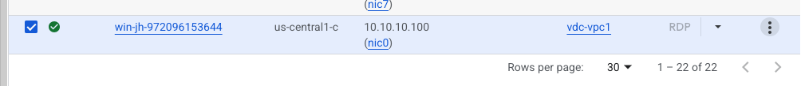

you can RDP into the jump host via the chrome remote desktop portal at [https://remotedesktop.google.com/access](https://remotedesktop.google.com/access)

The server should be lit up in the list:
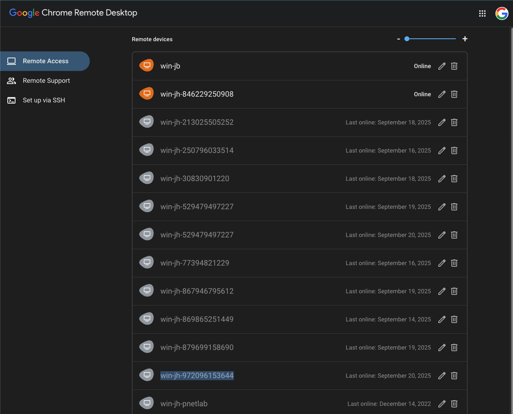

If as is the case here the sever does not come up, the crd tokens might have to be regenerated. You can run the redeploy script `main-crd-update.sh`. 

The crd pin code is `123456` and jump host password `Google1!`

Once RDP'ed into the cluster, you can use its chrome browser to connect to the pnetlab server via its internal IP: 
```
https://10.10.10.216
```
and login with admin/pnet.


## 1.3 Port forward to Interface

```bash
gcloud compute ssh root@vdc-pnetlab-v5-2 --tunnel-through-iap -- -Nf -L 8080:10.10.10.216:443
```

Once established you can verify that port forwarding is running using 
```bash
lsof -i :8080
```
on OSX or for Linux/CloudShell:
```bash
netstat -tulpn | grep ':8080' | grep 'gnubby-ss' | awk '{print $7}' | cut -d/ -f1
```


Once established you access the page on your local browser by browsing to: [https://localhost:8080](https://localhost:8080)

If you are using the windows jump host, you would just browse to the server  management IP address ([https://10.10.10.216](https://10.10.10.216))

Login with the default admin user credentials (admin/pnet) and choose the HTML console:


Once logged in pick the lab from the list (click on the name of the lab itself to show the preview) and then 'Open':


Note that you can zoom in and out of the topology using the slider in the bottom right corner of the interface:
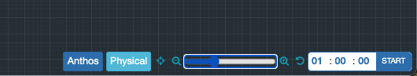

The network fabric is managed by a number of vyos devices that are to be powered on one by one. Note that with this current version of the lab built for the SME academy,  we only want to power on  the left of each router pair except for the spine L3 switches (both). Please also power on the winDC node:
a Node is powered on by hovering over the device as for example, for CE-B in the below screenshot:
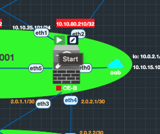

The lab should look like this once powered on:
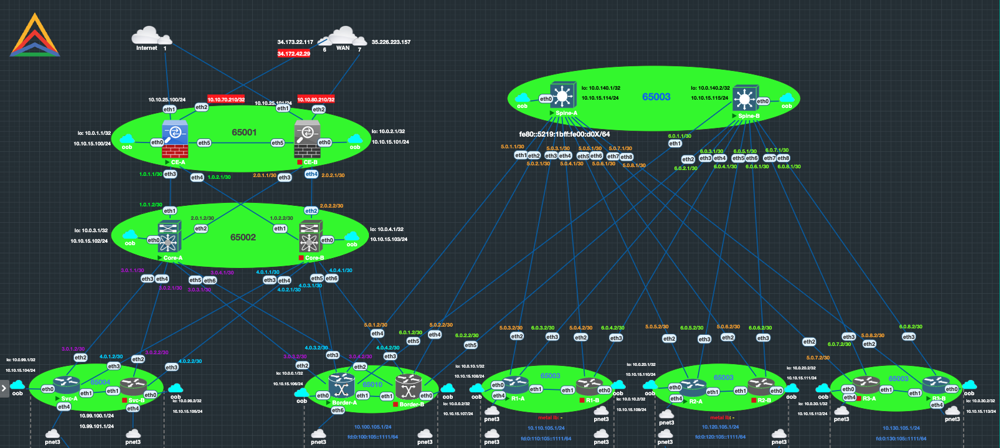


Note that the device in each rack, except for the winDC server (and template Linux server next to it), are unconfigured nodes used only as a visual representation of the servers we will be deploying as GCE instance on the GCP project for our GDC compute.

You should power them on as a visual aid. They use different colors to represent different purposes. The horizontal rectangular dashed boxes around sets of nodes are meant to show teh group of nodes used for a specific purpose (i.e. different GDC clusters).
They are colored to match the color o the admin node that manages their lifecycle. 

The set of blue linux nodes in the 4 row of the rack bays serve a different purpose (BGP validations) and thus are colored differently while both sets of Orange servers are user clusters managed by the abm10-adm1-r0-10-100-101-10 admin cluster node (single node admin cluster)


## 1.4 Validate lab devices connectivity


Once all vyos routers are started you can open a terminal session to each to validate connectivity to the internet. 

For example on the vyos router from Rack 3 Tor B:
- ping 8.8.8.8
- ping google.com


**!!! If connectivity fails !!!**

Make sure that the startup script customizing the pnet server TCP/IP stack (interfaces, addresses, vxlan tunnels, routes) ran.

SSH into the instance and check the interface configurations. It should show the pnet bridges being the ones owning the IP addresses.
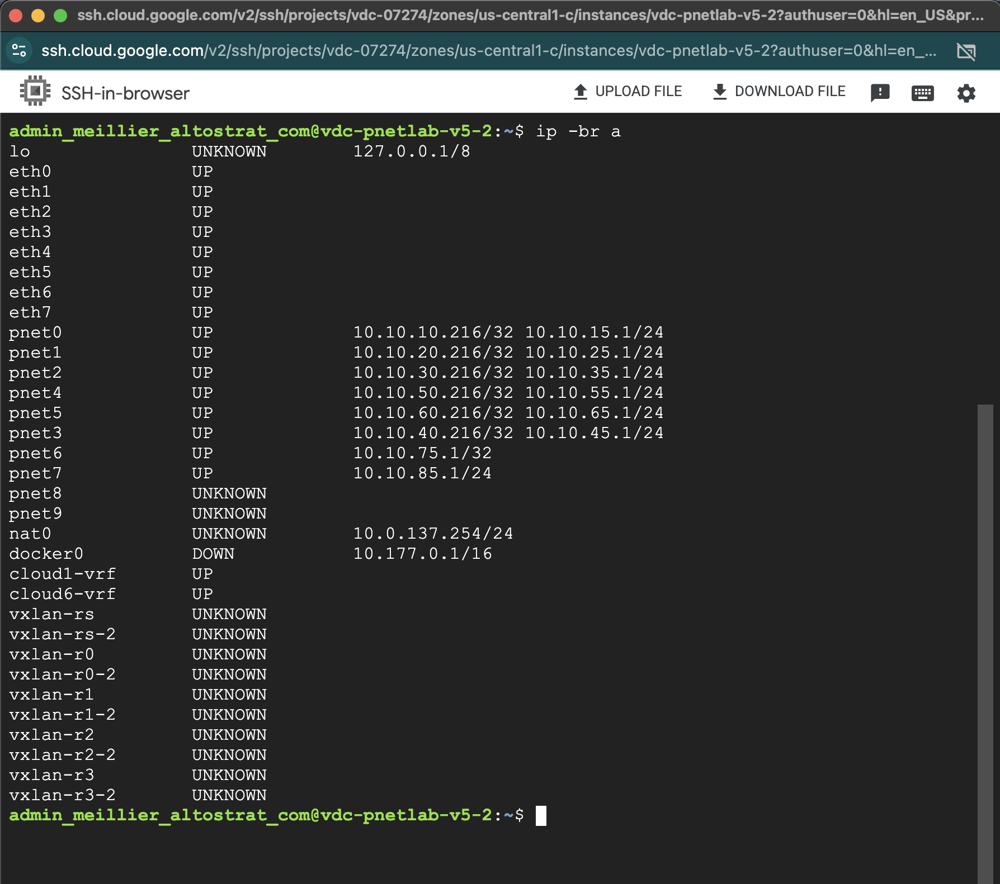


When the startup script fails to run due to timing issues, the pnet interfaces will not have those IPs assigned to the eth interfaces instead as in below image:

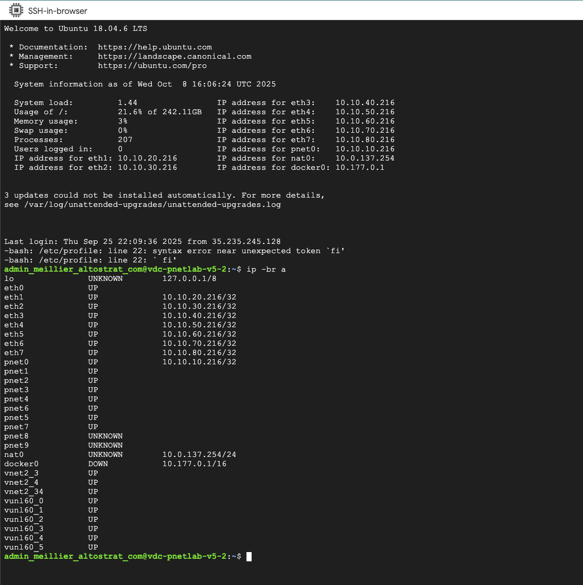

To fix this, you can run the script manually as root: with `./routes-fix-all-final.sh`:

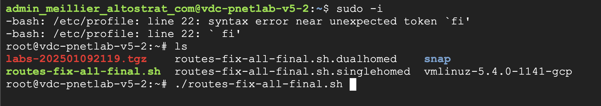

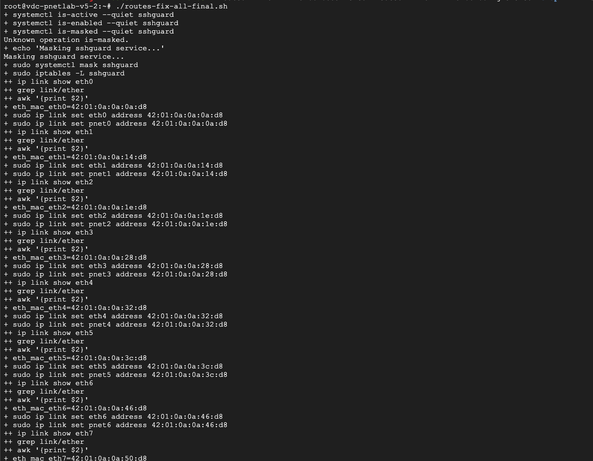
[...]
After the script runs, the interfaces should show the ip addresses assigned to the pnet bridges:
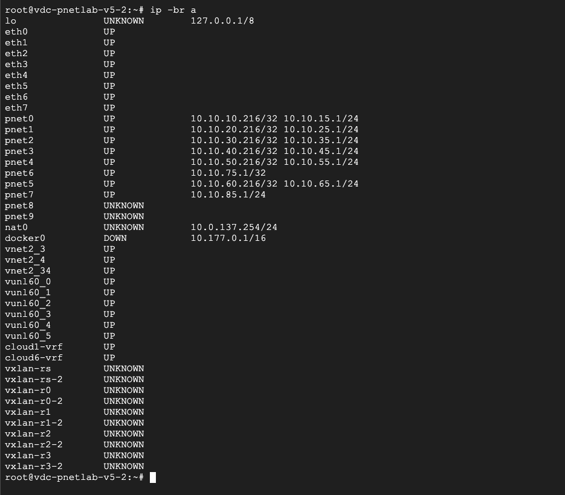


## 1.5 A note about vyos configs
Those come preconfigured for you, you might want to know how to configure your own additional vlans. Note that you can only define vlans from the 100-109 range of vlans. That is you cannot create vlan 10,11, 210,.... The reasons for that is that the appliance, interfaces and vpc subnets were created with a very deterministic ip addressing schema that would favcilitate troubleshooting of GCP networking issues and are intuitive. The exact schema followed is too esoteric to cover here and all you have to remember is that you can only have vlans from 100-109 defined which is plenty as each vlan is a /24 and has plenty of IPv4 addresses for nodes and k8s clusters floating virtual IPs.

```
vyos username: vyos
vyos password: vyos
```

You can look at how each device was configured with: 
```
show configuration commands
```

note the commands used to create vlans and gateways (HSRP/VVRP):


## (1.6 pnetlab Server internals)

This section is skipped for the purpose of the GDC SME academy.


if you are curious about the server inner workings
### bridges
### interfaces
### GCP Connectivity
- oob (pnet0)
- internet (pnet1)
- vxlan overlays (pnet3)
-  pnetX: Reserved for future use
### quemu processes


# Task 2: Servers Deployment
## 2.1 Terraform Deployment

Servers a deployed via the `/servers/tf/main-servers.tf` terraform file and its variables `/servers/tf/terraform-servers.auto.tfvars`


Servers follow a very strict naming convention allowing us to quickly identify their purpose, location, and IP.

For example "abm-ws-rs-10-99-101-10-ipv4-e2-standard-2":
- abm: an identifier of your choice. Typically to identify a specfiic cluster number
- ws: Can be anything except has to be ws for a workstation appliance as extra tools are downloaded for workstations and this code will identify whether or not the node is meant to be a workstation using that section of the server name
- rs: stands for Services Rack as we intend to deploy the server there.  Could also be r0 (border rack), r1, r2, or r3. Server location dictates the first two octet of its eventual ip address (10.99.x.x/24 for service rack servers, 10.100.x.x/24 for border rack, 10.110.x.x/24 for rack 1, 10.120.x.x/24 for rack 2 adn 10.130.x.x/24 for rack 3)
- 10-99: needs to be the the first two octets reserved for the rack 
- 101: this is the vlan (needs to be in the range 100-109 and gateways needs to be defined for it on the TORs)
- 99: this is ip. Anything you want.


For example here is the file with a few servers we want to be deployed:
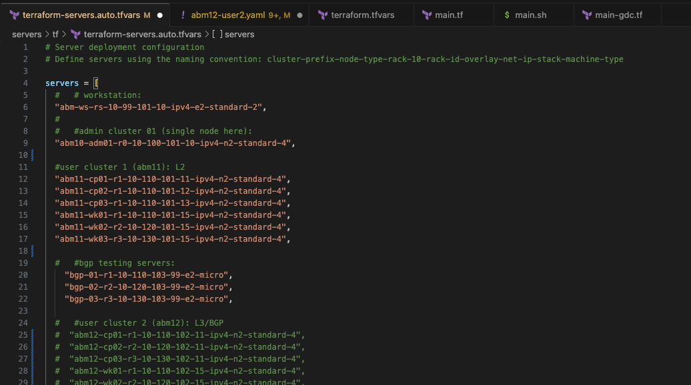


Once the servers list is defined, deploy the servers with a terraform apply on main-servers.tf:
```
servers/tf/terraform apply
```

## 2.2 Validate Connectivity

The servers should have connectivity but it is sometimes a good practice to go and check that they have access to the internet and that DNS works.  DNS will only work if our dns server hosted by the win-DC appliance is running (so remember for it to be powered up).

The windows domain controller and dns server is a qemu node running on pnetlab 
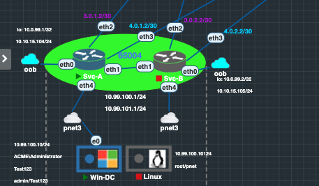
win-DC is accessible via the pnetlab Terminal:

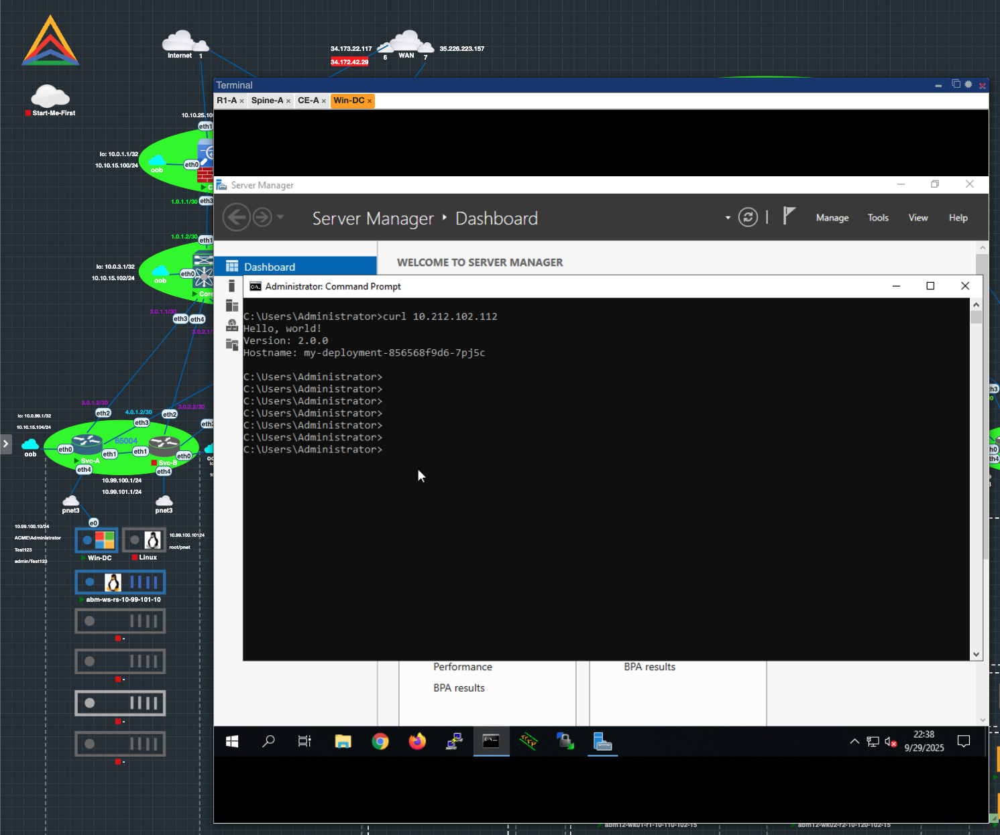
the username and password is provided in our topology next to the server. 
Because the Guacamole terminal will not respond to keyboard combination keys, we need to use the interactive keyboard. 

On a MAC hit Ctrl+alt+Shift:
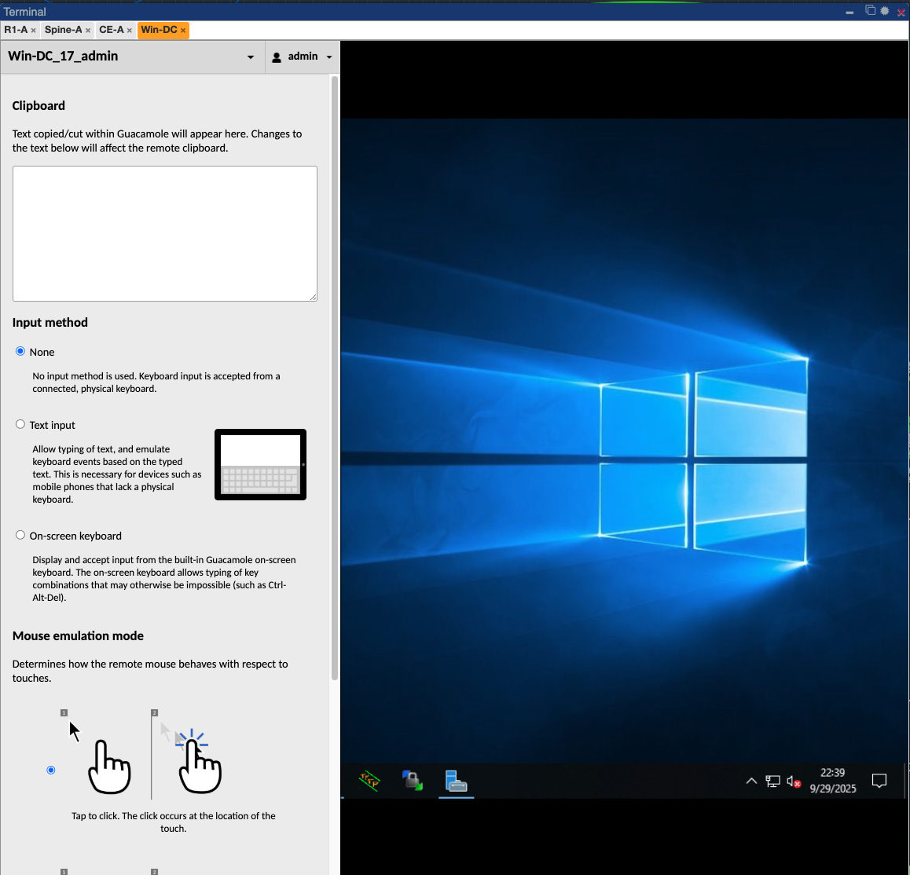
and select On-screen keyboard to trigger the windows ctrl+alt+del keys combination input

You can then close the on-screen keyboard and use the same key combinations to escape the panel assistant.


You can either use GCP's console ssh windows or ssh directly to the server via the iap proxy with:
```
gcloud compute ssh abm12-wk01-r1-10-110-102-15-ipv4 --tunnel-through-iap
```

A server will have two interfaces with a vxlan device attached to the second interface (ens5)

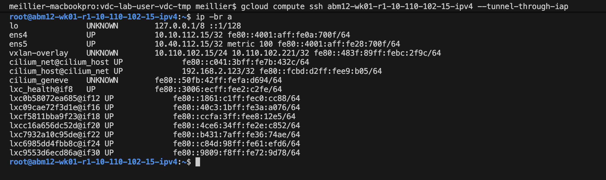
ens4 is used for out of band connectivity to/from GCP from/to the instance. Similar to a idra-ILo interface.

From the server verify that it can hit the internet and can resolve FQDNs such as google.com:
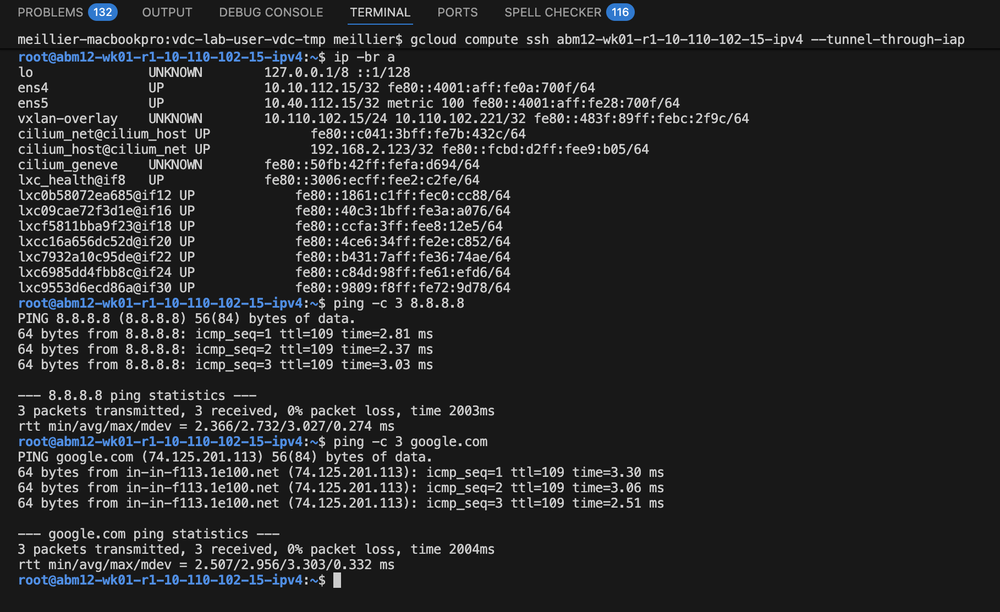

## 2.3 Update logical topology
Finally, the logical topology to help you remember and visualize what has been deployed and what the servers are.

'Power on*' the node as needed:
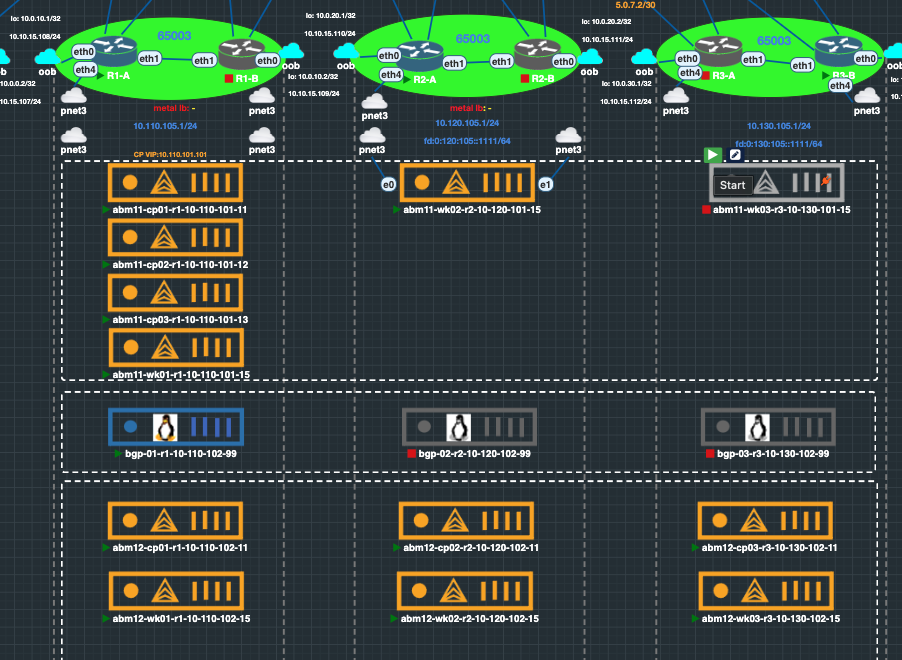
*Those are nodes with zero CPU/Mem allocations. Their only purpose is to complete the diagram. The servers themselves are the GCE instance deployed by Terraform.

For example for abm11-wk03-r3-10-130-101-15:

If you see some Memory assigned feel free to reset it to 0.


# Part II
# Task 3: GDC-BM Fleet hub project

We need to create the GCP project that will act the fleet hub project that GDC project register to.
## 3.1 Terraform Configuration file


One needs to run the terraform apply on gdc-gcp-project/tf/main-gdc.tf .

terraform-gdc.auto.tfvars does not need to be customized as main.sh took care of that.

There isn't much for you to do as it is handled by main-gdc.tf. Just execute and move on to the section about severs deployments.

## 3.2 Roles, APIs, Service Accounts


Note that the bmctl cli used to create an admin cluster can automatically create the service accounts and enable the service on a fleet project that the cluster would register to (see the section 4.2 at [bmctl optional flags](#about-bmctl-optional-flags)). 

Here, we created the service accounts and enabled the services ourselves upon creating the project. 


### Service Accounts

[https://cloud.google.com/kubernetes-engine/distributed-cloud/bare-metal/docs/installing/configure-sa](https://cloud.google.com/kubernetes-engine/distributed-cloud/bare-metal/docs/installing/configure-sa)

### Services
The services are enabled via the google_project_service.gdc_apis resources in main-gdc.tf:
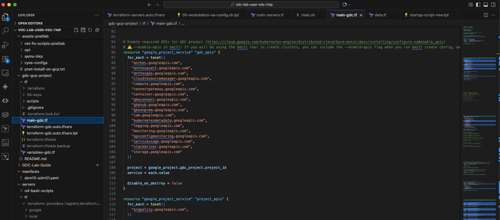
Doc link: https://cloud.google.com/kubernetes-engine/distributed-cloud/bare-metal/docs/installing/configure-sa#enable_apis


### Roles

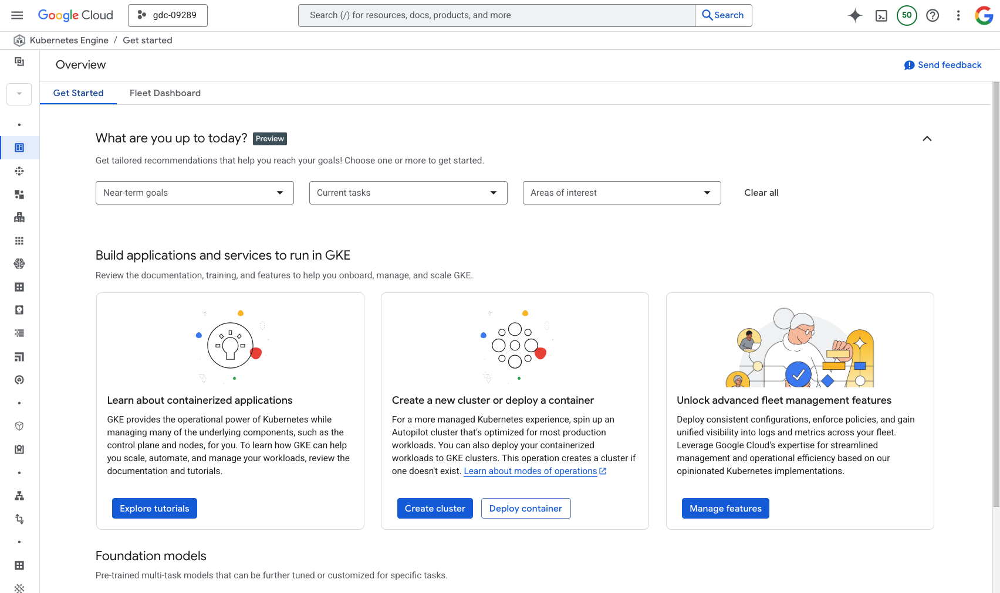

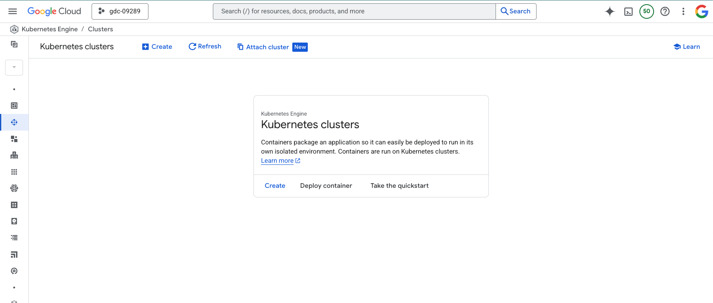


# Task 4: GDC Clusters Deployment

## 4.1 Workstation Appliance

You download and run tools, such as `bmctl` and the Google Cloud CLI, on the admin workstation to interact with clusters and Google Cloud resources. The admin workstation hosts configuration files to provision clusters during installation, upgrades, and updates. Post installation, the admin workstation hosts `kubeconfig` files so that you can use `kubectl` to interact with provisioned clusters. You also access logs for critical cluster operations on the admin workstation. A single admin workstation can be used to create and manage many clusters.

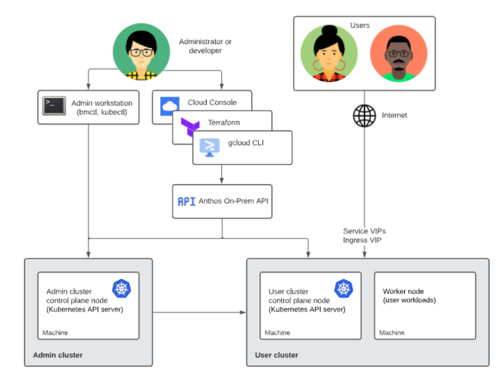

### Optional read: Prerequisites refresher
#### Support OS: Validation

In order to run `bmctl` and work as a control plane node, the admin workstation has the same operating system (OS) requirements as nodes

Requirements for the admin workstation can be found at this link [https://cloud.google.com/kubernetes-engine/distributed-cloud/bare-metal/docs/installing/workstation-prerequisites#operating_system_and_software](https://cloud.google.com/kubernetes-engine/distributed-cloud/bare-metal/docs/installing/workstation-prerequisites#operating_system_and_software)

The OS needs to be one of the following:

- RHEL 9.4
- RHEL 9.2
- RHEL 8.10
- 24.04 LTS[1](https://cloud.google.com/kubernetes-engine/distributed-cloud/bare-metal/docs/installing/os-reqs#footnote-1), [2](https://cloud.google.com/kubernetes-engine/distributed-cloud/bare-metal/docs/installing/os-reqs#footnote-2)
- 22.04 LTS

[1] Ubuntu 24.04 LTS is supported for Google Distributed Cloud version 1.33.0 and later.
[2] Google Distributed Cloud doesn't support the 6.14 kernel package for use with Ubuntu 24.04 LTS.


The lab was made to deploy ubuntu instance. The network customization script (/home/01-network-setup.sh) was not tested on 24.04 but will work for 22.04. The version to use for instance deployment is a parameter of the terraform-servers.auto.tfvars:

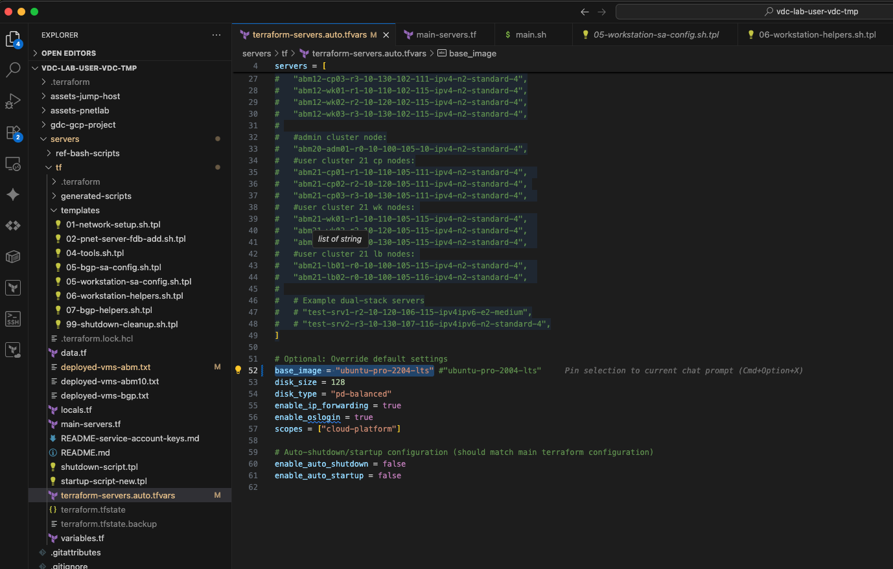

and on the instance:
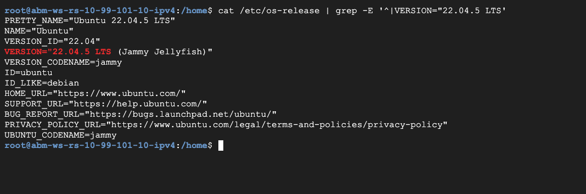

OS configuration requirements can be found at 
[https://cloud.google.com/kubernetes-engine/distributed-cloud/bare-metal/docs/installing/configure-os/ubuntu](https://cloud.google.com/kubernetes-engine/distributed-cloud/bare-metal/docs/installing/configure-os/ubuntu)


#### Hardware Requirements

The admin workstation requires significant computing power, memory, and storage to run tools and store the resources associated with cluster creation and management.
This is one of the reason why we had to have compute nodes for our virtual datacenter be deployed as GCE instances rather than hosted directly on the pnet server as qemu processes. The pnetlab sever would imply not have enough compute resources to handle all our compute needs.  

More info at [https://cloud.google.com/kubernetes-engine/distributed-cloud/bare-metal/docs/installing/workstation-prerequisites#hardware_resource_requirements](https://cloud.google.com/kubernetes-engine/distributed-cloud/bare-metal/docs/installing/workstation-prerequisites#hardware_resource_requirements)


#### ssh and ip forwarding requirements

The servers were configured with the requirements from [https://cloud.google.com/kubernetes-engine/distributed-cloud/bare-metal/docs/installing/workstation-prerequisites#ip_forwarding](https://cloud.google.com/kubernetes-engine/distributed-cloud/bare-metal/docs/installing/workstation-prerequisites#ip_forwarding)/

```
cat /proc/sys/net/ipv4/ip_forward
```

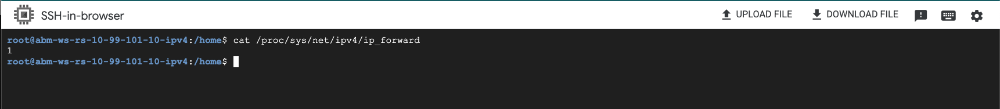
and PermitRootLogin in /etc/ssh/sshd_config

```
cat /etc/ssh/sshd_config
```
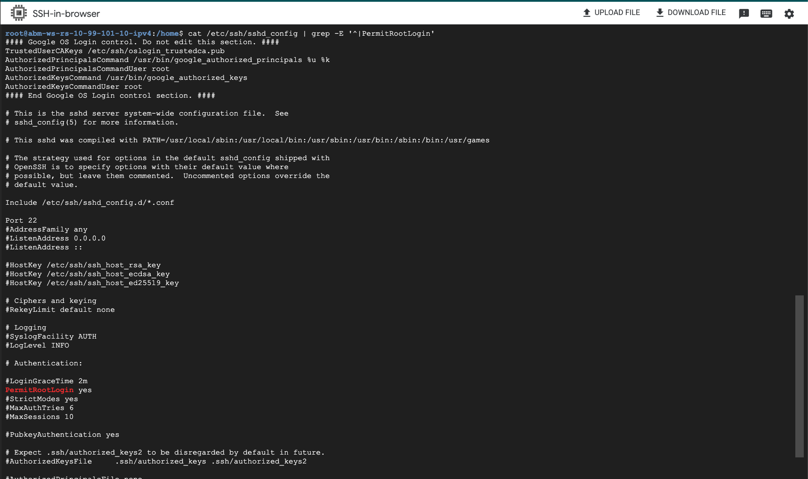

### Connectivity validations

Make sure that our workstation appliance has been deployed (see Task 2). 

Its deployment is managed by servers/tf/main-servers.tf using the variables defined in terraform-servers.auto.tfvars. For example here we only have the workstation GCE instance deployed:
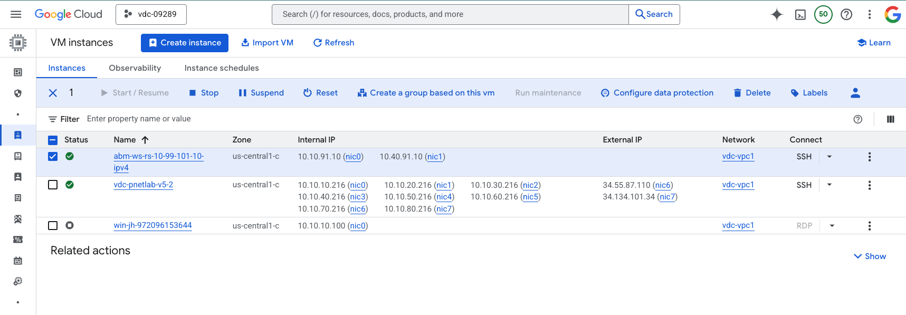

terraform-servers.auto.tfvars in servers/tf/ is where we get to set the servers we want to deploy:
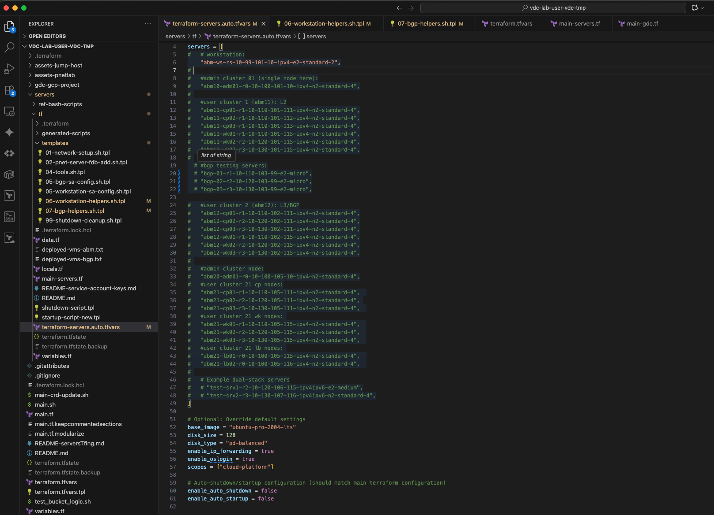
There is a stric naming convention to follow when deploying servers a server's network configuration is extracted from elements in the name.

For example, for the server we just deployed: `abm-ws-rs-10-99-101-10-ipv4-e2-standard-2`
- abm : Can be whatever. Just a node purpose identifier. See other nodes in the using 'bgp' (bgp testing appliance), abm11 (abm cluster 11),...
- ws: ws for workstation (required to specify ws if want the server to be auto-provisioned with elemnts needed by a workstation such as docker, service account keys,...). Otherwise can be anything
- 10-99: need to use 10-99 if want the server to be configured for runnign in the service rack
	- 10-100 for Broder rack
	- 10-110 for Rack1
	- 10-120 for Rack2
	- 10-130 for rack3
- 101*: the vlan in the rack. The racks come pre-configured with a number vlans. We an only have vlans from 100 to 109 but it is plenty. See below screenshot for information on how those are configure on the TORs.
- 10: this will the last octet of the server IP


As its name indicates, we chose to deploy the appliance in the service rack on vlan 101 with IP 10.99.101.10*
(* 10.99  is for all servers deployed in the service rack. Teh second octet, 99 is for the service rack. 100 is for servers deployed in the border rack, 110 for rack 1, 120 rack2, and 130 rack3.)
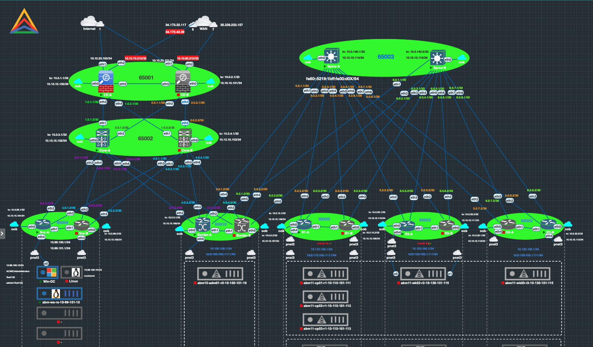
we can validate the Svc-A TOR has the 10.99.101.1 gateway address on its bridge br-100 with the command 
```
	show interfaces bridge
```

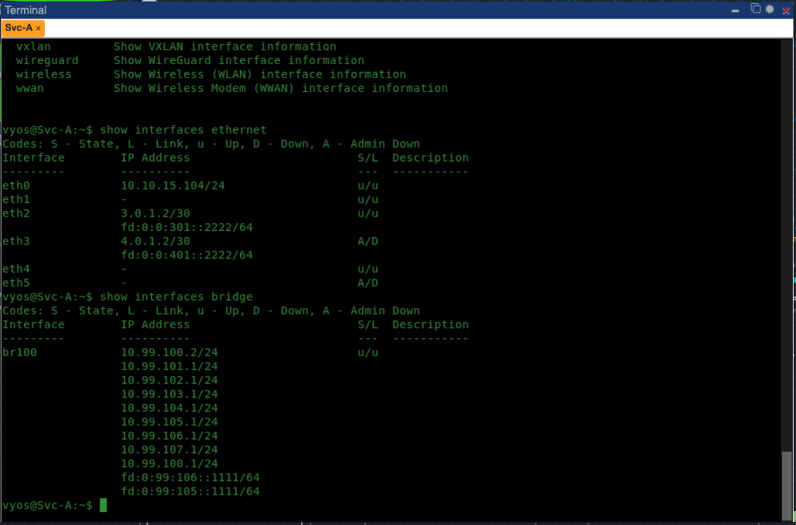

You can thus ping the server from the switch, and from the the gateway from the server:
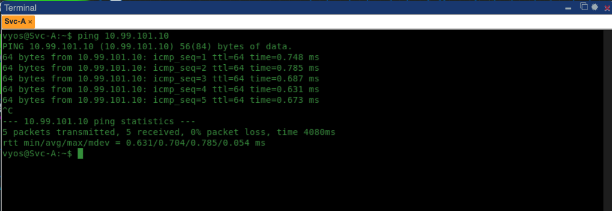
and from the server the gateway, internet, with dns resolutin provided by the winDC server working (⚠️ DNS will not work if the dns server, winDC is powered off)

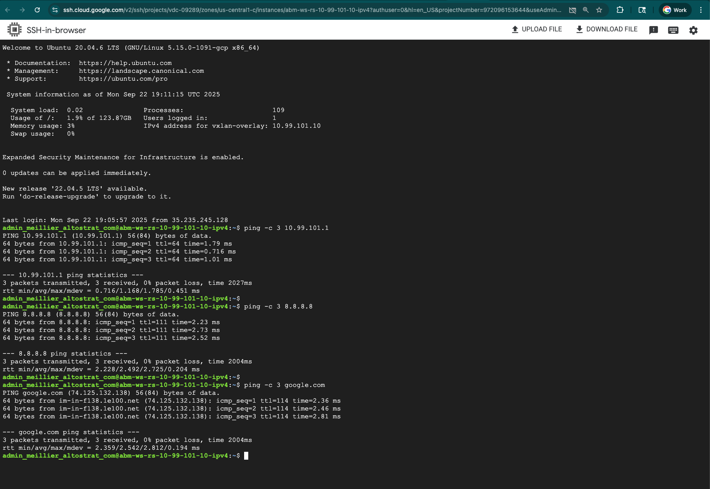


Just to prove that traffic is 100% handled by our network appliance and that the traffic is not taking some back channel on the GCP fabric, we can login to the service rack TOR and disable the eth4 interface that the server relies on a next hop:

```
config
set interface ethernet eth4 disable
commit save
```

Validate that the server no loner has connectivity:

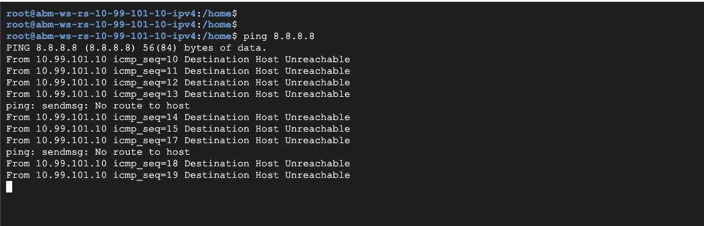

enable the port/interface again:
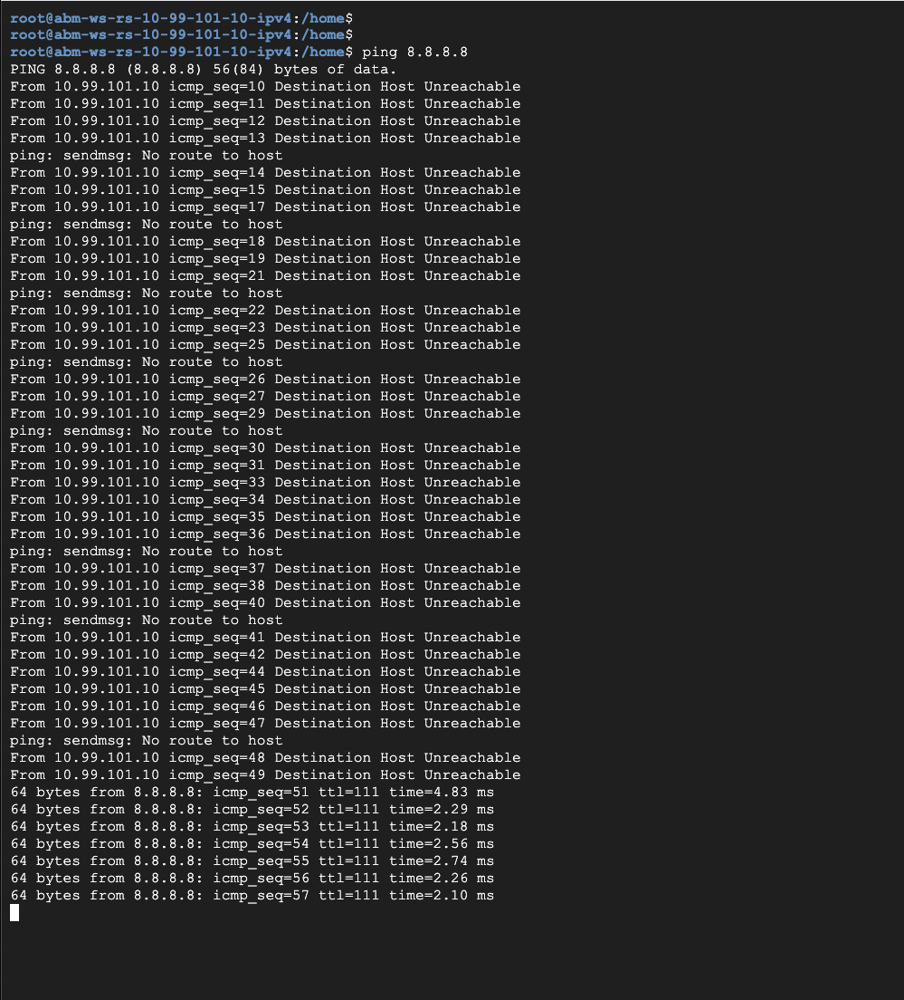

Note that because we have setup an out-of-band management interface on the GCE server, akin to a DRAC or iLO interface on DELL or HP servers, we never loos ssh connectivity to the GCE instance itself.

Note that each virutal router on the appliacne also has dedicated oob management interfaces (eth0) intefaces so that connectivity to these routers (ssh) is possible even when the network fabric is down. 
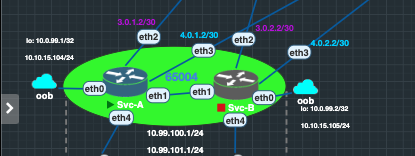

For example, from the windows jump host, which has connectivity to that same VPC subnet used for oob managment (10.10.1X.0/24), you could ssh to a vyos router despite all of its other interfaces being shut (or next devices it connects to being down).


### FYI: vyos vlan configuration
*VLAN Configuration*
The below screenshot shows how the gateway 10.100.101.1 was configured on the Rack1 TOR-A:
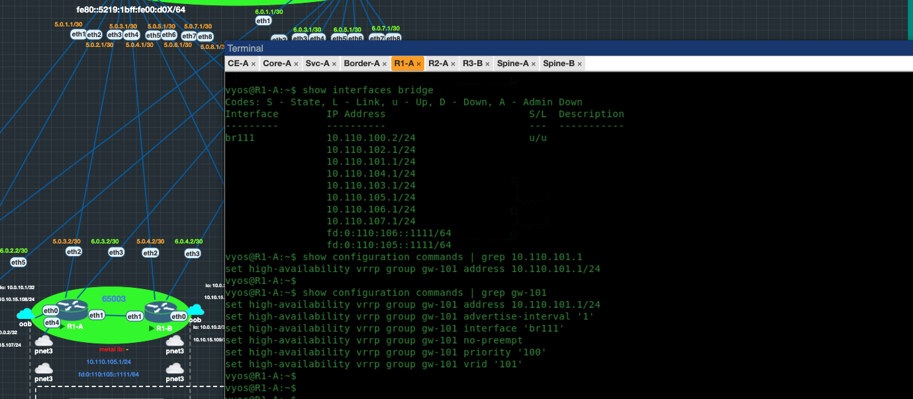

```zsh
vyos@R1-A:~$ show interfaces bridge 
Codes: S - State, L - Link, u - Up, D - Down, A - Admin Down
Interface        IP Address                        S/L  Description
---------        ----------                        ---  -----------
br111            10.110.100.2/24                   u/u  
                 10.110.102.1/24                        
                 10.110.101.1/24                        
                 10.110.104.1/24                        
                 10.110.103.1/24                        
                 10.110.105.1/24                        
                 10.110.106.1/24                        
                 10.110.107.1/24                        
                 fd:0:110:106::1111/64                  
                 fd:0:110:105::1111/64                  
vyos@R1-A:~$ show configuration commands | grep 10.110.101.1
set high-availability vrrp group gw-101 address 10.110.101.1/24
vyos@R1-A:~$ 
vyos@R1-A:~$ show configuration commands | grep gw-101
set high-availability vrrp group gw-101 address 10.110.101.1/24
set high-availability vrrp group gw-101 advertise-interval '1'
set high-availability vrrp group gw-101 interface 'br111'
set high-availability vrrp group gw-101 no-preempt
set high-availability vrrp group gw-101 priority '100'
set high-availability vrrp group gw-101 vrid '101'
```

For example, say you wanted to configure a new vlan on that rack. vlan108 which from the above output does not exist. 
you would create a new vrrp group by first going into config mode (`config`) and entering:
```
set high-availability vrrp group gw-108 address 10.110.108.1/24
set high-availability vrrp group gw-108 advertise-interval '1'
set high-availability vrrp group gw-108 interface 'br111'
set high-availability vrrp group gw-108 no-preempt
set high-availability vrrp group gw-108 priority '100'
set high-availability vrrp group gw-108 vrid '108'
```


First let's test to make sure that this address cannot be pinged:


then commit and save the config:

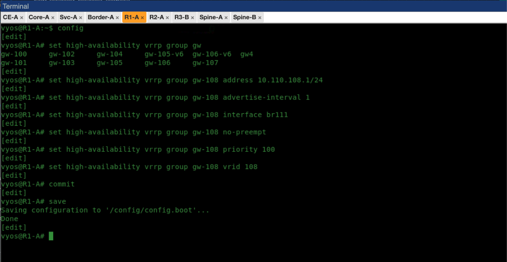
and now ping again from CE-A:
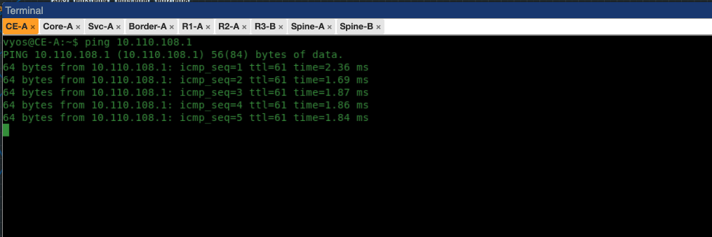
to delete the new vrrp group , in config mode do:
```
config
del high-availability vrrp group gw-108
commit
```

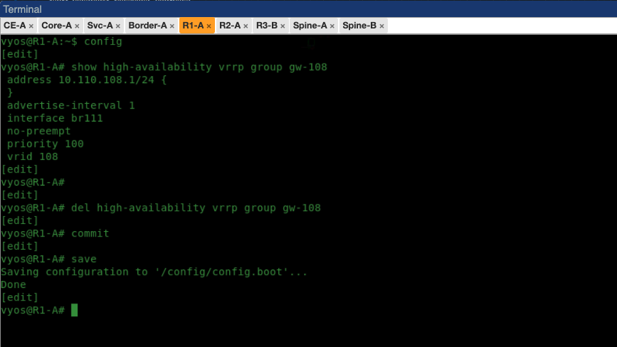

and now CE-A can no longer ping the address:
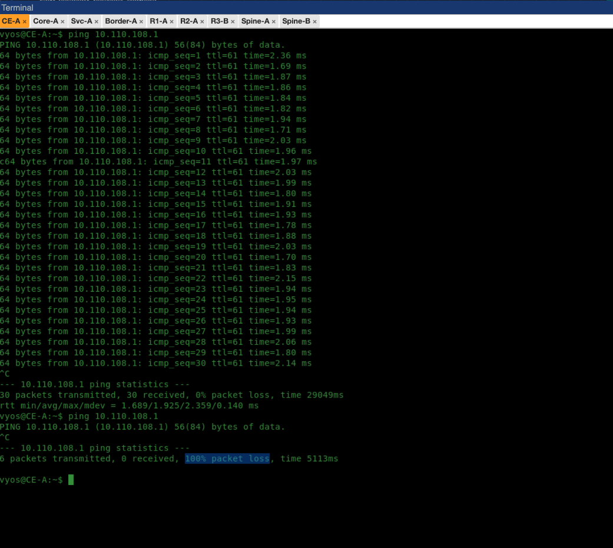

For more information about VyOS configuration see: [https://docs.vyos.io/en/1.4/configuration/index.html](https://docs.vyos.io/en/1.4/configuration/index.html)


Note* The lab provided here only has leg-A of each pair of routers configured for connectiity troubleshooting purposes.  AS such the gateway of the vrrp group only always lives on that one router. However if you were to configure the other leg, the gateway would be floating across both routers (i.e. only one router own the gateway but it can failover). This is why the interface it is set on is a bridge , a bridge that contains both the eth4 interface connecting southbond to the servers and the eth1 ISL (inter-switch link) interface that carries the heartbeat messages and for negotiating ownership and failover of the gateway. The preempt setting is to prevent flapping and the priority is to give more weight to a specific router for the assignment of the gateway when both are available.


### Authentication


Make sure that you are authenticated with your user account and that the proper ADCs are set for the gcloud command used during cluster creations (e.g. registration with the fleet  project)

```
glcoud auth login --update-adc
```
and
```
gcloud auth application-default login
```

*Note:  
'gcloud auth login --update-adc'  only updates the ADC for your _user account_, but many GKE/Cloud Shell/Service tasks require the higher-privilege ADC provided by the _separate_ command

### bmctl

`bmctl` is the command-line tool for Google Distributed Cloud that simplifies cluster creation and management. For more information about what you can do with `bmctl`, see [`bmctl` tool](https://cloud.google.com/kubernetes-engine/distributed-cloud/bare-metal/docs/reference/bmctl)

bmctl will handle downloading the binaries from the anthos baremetal public repository, unless we were to use a registry mirror in which case the binaries would be have been downloaded ahead of time using:

```bash
gcloud storage cp gs://anthos-baremetal-release/bmctl/VERSION/linux-amd64/bmpackages_VERSION.tar.xz .
```
See [doc link](https://cloud.google.com/kubernetes-engine/distributed-cloud/bare-metal/docs/downloads#download_the_images_package).


In this lab, any GCE instance marked as a workstation will have bmctl pre-installed:


This is done by a startup script run at boot on the GCE instance (only servers with prefix set to 'ws'.


You can see that the version to download was hardwired to 1.15 in the script (not parameterized yet). Hence it is likely that the download will fail. The download of the desired bmctl/GDC  version is something the user would do anyway.


In a real customer environment, the workstation would not be a GCE instance obviously. It would typically be a VM in their environment, .... They would have to install bmctl as per the instructions from  https://cloud.google.com/kubernetes-engine/distributed-cloud/bare-metal/docs/downloads#download_bmctl


Here we will reinstall bmctl to use a currently supported version (GDC only supports 3 versions at a time), making sure to not install the latest version so as to eventually test upgrades later in the lab.

To install v1.32 we will redefine `BMCTL_VERSION`, download the file with gsutil, and move it to /usr/local/sbin.

Fist we need to gcloud auth login. 
https://cloud.google.com/kubernetes-engine/distributed-cloud/bare-metal/docs/downloads#sign_in

Again, because our workstation is a GCE instance, it is automatically setup with the compute engine service account:

But this would not be the case on a customer environment. We should instead login s our cloud admin account:

```
gcloud auth login --update-adc
```


choose your admin account (admin@meillier.altostrat.com for me) and go thru the token generation link:


You should now be auth'ed as your admin user account:


Next download the new bmctl (see https://cloud.google.com/kubernetes-engine/distributed-cloud/bare-metal/docs/downloads#download_bmctl)
```
cd /home/baremetal
BMCTL_VERSION='1.32.400-gke.68'
sudo gsutil cp gs://anthos-baremetal-release/bmctl/${BMCTL_VERSION}/linux-amd64/bmctl .
sudo chmod a+x bmctl
sudo mv bmctl /usr/local/sbin/
```

and validate the version of bmctl:

```
bmctl version
```


Note: In our lab, make sure to download as root.

### About the gcloud cli
Normally one would also want to instrument the workstation with gcloud cli. We actually already used it earlier to authenticate with our user account.
Here again, we are using a GCE instance so it comes equipped with the gcloud cli. A customer would however have to install the gcloud cli.


### About docker & bootstrap cluster


When Google Distributed Cloud creates self-managed (admin, hybrid, or standalone) clusters, it deploys a [Kubernetes in Docker](https://kind.sigs.k8s.io/) (kind) cluster to temporarily host the Kubernetes controllers needed to create clusters. This transient cluster is called a bootstrap cluster. Once the cluster is properly configured in kind, a pivot operation is performed to transfer the cluster to its destination server.

User clusters on the other hand are created and upgraded by their managing admin or hybrid cluster without the use of a bootstrap cluster.


During the creation of the admin cluster, the output of the bmctl command will show the creation of the bootstrap cluster:


We will revisit the bootstrap cluster in Task 6 but for now, the creation and deletion of a bootstrap cluster is not something for a typical user/customer to worry about as its creationg should be transparent to the customer. All they need to worry about is eventually having the generated cluster being accessible on the target deployment server.


The bootstrap cluster is why  docker is required on the admin workstation ([doc](https://cloud.google.com/kubernetes-engine/distributed-cloud/bare-metal/docs/installing/workstation-prerequisites#operating_system_and_software)). 


In the lab, Docker is pre-installed on the workstation via the /home/04-tools.sh startup script executed at instance first boot.

```
cat /home/04-tools.sh
```


Docker version is:

```
docker version
```


If for some reason the workstation in your lab does not have the added binaries such as docker or kubectl installed, rerun the startup script `/home/04-tools.sh`


kubectl is also pre-installed using

```
curl -LO "https://storage.googleapis.com/kubernetes-release/release/$(curl -s https://storage.googleapis.com/kubernetes-release/release/stable.txt)/bin/linux/amd64/kubectl"
chmod +x kubectl
mv kubectl /usr/local/sbin/
```


```
kubectl version
```


*The latest documentation recommends using 

```
gcloud components install kubectl
```

Note that in our GCE instance, the above will fail because of the google cloud cli being managed:


## 4.2 Admin cluster

### Server
We will create the admin cluster on a node of the Border rack: `abm10-adm01-r0-10-100-101-10`
Again, the important parameters of the server name are r0  and 101 and 10
- r0: dictates which rack the server will be deployed to and hence it server ip second octet (100 in 10.100.101.10)
- 100: the vlan. You need to make sure there is a gateway for vlan on that rack (10.100.101.1)
- 10: the server ip last octet.

This is the orange cluster in our topology:


 in `/servers/tf/terraform-servers.auto.tfvars`, uncomment the server name definition for the adm01 server:

and run terraform apply


Terraform will provide the summary of deployed servers including our newly added admin cluster node:


You can verify the presence of the cluster in the console 

or gcloud cli:

```
gcloud compute instances list | grep -E '^|abm10-adm01-r0-10-100-101-10-ipv4' --color=always
```


ssh to the server and confirm it has network connectivity:


### Cluster manifest

Ref doc URL: [https://cloud.google.com/kubernetes-engine/distributed-cloud/bare-metal/docs/installing/creating-clusters/admin-cluster-creation#create_an_admin_cluster_config_with_bmctl](https://cloud.google.com/kubernetes-engine/distributed-cloud/bare-metal/docs/installing/creating-clusters/admin-cluster-creation#create_an_admin_cluster_config_with_bmctl)

Now we need to build the ymal manifest that will tell the workstation to prep that node as an admin cluster node.

On the workstation, we need to generate a cluster manifest which is done via the bmtcl command. 
Our cluster name will be `abm10-adm1`. The project is the project that cluster will register itself to, the project created by gdc-gcp-project/tf/main-project.tf

That project bears the same random sufix that was created for our pnetlab vdc project and was created under the same folder:

#### Generate template manifest

On our workstation, under the /home/baremetal folder we run:

```
ADMIN_CLUSTER_NAME=abm10-adm01
FLEET_PROJECT_ID=gdc-09289

bmctl create config -c $ADMIN_CLUSTER_NAME --project-id=$FLEET_PROJECT_ID
```


This generates a template admin cluster manifest in bmctl-workspace for cluster abm10-adm01:
```
vimcat bmctl-workspace/abm10-adm01/abm10-adm01.yaml
```

It chose to create cluster folders under a folder called `bmctl-workspace` because it is the default in the bmctl config:

  
The generated manifest gives you a template to work from with some of the fields such as cluster name and project IDs already filled in for you:

It easier to scp the manifest back to our IDE than managing the manifest locally on the remote server. Plus downloading the manifest to our IDE allows us to commit its config to the git repo.

On the IDE terminal, while cd'ed into the target manifests directory, scp the yaml back to our local vscode environment:

```
gcloud compute scp root@abm-ws-rs-10-99-101-10-ipv4:/home/baremetal/bmctl-workspace/abm10-adm01/abm10-adm01.yaml ./
```


The manifest can be edited locally and scp'ed back to the server:


-----

Edit the configuration file ([https://cloud.google.com/kubernetes-engine/distributed-cloud/bare-metal/docs/installing/creating-clusters/admin-cluster-creation#edit_config](https://cloud.google.com/kubernetes-engine/distributed-cloud/bare-metal/docs/installing/creating-clusters/admin-cluster-creation#edit_config))

Instructions are also provided in the documentation here: [https://cloud.google.com/kubernetes-engine/distributed-cloud/bare-metal/docs/installing/creating-clusters/admin-cluster-creation#edit_config](https://cloud.google.com/kubernetes-engine/distributed-cloud/bare-metal/docs/installing/creating-clusters/admin-cluster-creation#edit_config)

Sample cluster configurations can be found at [https://cloud.google.com/kubernetes-engine/distributed-cloud/bare-metal/docs/reference/config-samples#admin-basic](https://cloud.google.com/kubernetes-engine/distributed-cloud/bare-metal/docs/reference/config-samples#admin-basic)
#### SA keys section


on our server the service acccounts created with the gdc-XXXX project were downloaded to `/home/baremetal/sa-keys`


so we update the paths accordingly.

The ssh key is in /root/.ssh 


This section will thus be:

```yaml
gcrKeyPath: /home/baremetal/sa-keys/anthos-baremetal-gcr.json
sshPrivateKeyPath: /root/.ssh/id_rsa
gkeConnectAgentServiceAccountKeyPath: /home/baremetal/sa-keys/anthos-baremetal-connect-agent.json
gkeConnectRegisterServiceAccountKeyPath: /home/baremetal/sa-keys/anthos-baremetal-connect-register.json
cloudOperationsServiceAccountKeyPath: /home/baremetal/sa-keys/anthos-baremetal-cloud-ops.json
```


#### namespace and name
we keep those as is since they were generated with the bmctl command


#### Cluster type
change to admin


#### fleet project

This is the project ID of the GCP project that the cluster register to


#### Control plane node ip
our server's IP. Admin clusters only have control planes and this could be more than 1 for resiliency purposes but in the lab, we will be fine using just one.


this is obviously the server deployed to be the admin cluster node

#### Pods & Services cidrs

Unlike gke (on GCP), GDC uses the island mode networking model, which is very convenient as one does not need to worry about overlapping pod networking cidrs. We will reserve `192.168.0.0./16` for the pods and `172.16.0.0/16` for the services.  


#### Load Balancer (CP)

We will use bundled L2 for this first cluster (BGP for another)
Bundled L2 uses will metalLB in L2 mode for the dataplane while the control plane will use haproxy+keepalived.


the Control plane vip is assigned to one of the nodes (just one here in our case) and because we are using L2, needs to be in the same L2 domain as the nodes.

from the [documentation](https://cloud.google.com/kubernetes-engine/distributed-cloud/bare-metal/docs/installing/bundled-lb#control_plane_load_balancing):
```
The control plane load balancer serves the control plane virtual IP address (VIP). Google Distributed Cloud runs Keepalived and HAProxy as Kubernetes static pods on the load-balancer nodes to announce the control plane VIP. Keepalived uses the Virtual Router Redundancy Protocol (VRRP) on the load balancer nodes for high availability.
```
Our node is in the 10.100.101.0/24 network. We will use 10.100.101.100 as our CP vip.


Note: we will take note of the admin node interface ip configuration to compare with how it looks once the server is configured as an admin cluster CP node:


Note: this is not a typical server interface configuration. Here we have an ens4 interface used for oob sever mgmt (for gcp) and an interface used for overlay networking from/to the server and the network appliance. 
The vxlan-overlay interface is the one owning the server IP and it is attached to the ens5 interface which acts as its VTEP


The routing table shows how our default route is funneled through the vxlan overlay interface


while access to GCP metadata server has specific routes stirring the traffic through the ens4 interface.


#### Cluster Operations (logging)
The same project that we used for gke connect. our only 'real' gcp project.


#### max pod density

Details about each setting can be found in the cluster configuration field reference at [https://cloud.google.com/kubernetes-engine/distributed-cloud/bare-metal/docs/reference/cluster-config-ref](https://cloud.google.com/kubernetes-engine/distributed-cloud/bare-metal/docs/reference/cluster-config-ref)


Specifying a density of 250 pods (per node) means that a /23 will be assigned to the node for its pod cidr. just like GKE, Pod cidr over-provisioning is used in GDC, which is less of a problem here as GDC uses teh island mode networking mode.


We will set pod density to 110 so that each node gets assigned an easy-to-understand /24 subnet to each node:


#### gkeOnPremApi
We leave that section commented our so that oru cluster will not enroll to the gke onPrem API endpoint and for us to see what gke onPrem API brings to the table when clusters are enrolled to it ( acluster can be enrolled to the gke onPrem api in post). 


#### worker nodes node pool:
We will comment this out as this is an admin cluster and it will not have worker nodes.


#### Note: Automatic Authentication
We will see later how one will have to take additonal steps for getting the GCP console's user  to get logged into the clusters.
Using the below cluster spec would automate that process. We will use it later when deploying other clusters.


https://cloud.google.com/kubernetes-engine/distributed-cloud/bare-metal/docs/reference/cluster-config-ref#clustersecurity-authorization-clusteradmin-gcpaccounts


#### xfer manifest back

Now that we have created the cluster manifest, we can scp it back to the workstation (where it needs to be)

We first have to scp it to the user home directory (we cannot scp the file directly into the root directory. Note that it would have been easier for bmctl ):

```
gcloud compute scp ./abm10-adm01.yaml root@abm-ws-rs-10-99-101-10-ipv4:~
```


and then from the workstation:
```
mv /home/admin_meillier_altostrat_com/abm10-adm01.yaml /home/baremetal/bmctl-workspace/abm10-adm01/
```


### About bmctl optional flags:

When creating the admin cluster for the first time on a new Fleet project, bmctl provides the option to handle the enablement of the project services and the creation of the service accounts and keys if those were not created ahead of time ( as we did). The two flags in question are `--enable-apis` and `create-serice-accounts`:

#### --enable-apis


```
--enable-apis
```
We do not need to use the '--enable-apis flag' as the project we created for our Fleet hub project had all the necessary services enabled. 


#### --create-service-accounts

```
--create-service-accounts
```
we also do not need to have bmctl create the service accounts on the fleet project as those were also created by terraform.


### Create Cluster
Now we can create the cluster referencing the config with the -c flag pointing to the path of the abm10-adm01  folder that contains the yaml:

```
bmctl create cluster -c abm10-adm01
```

⚠️ Make sure you run the command while in the baremetal directory and not the bmctl-workspace directory.

The deployment will start with creating the bootstarp cluser:


GKE onPrem API mention & preflight check operator deployment:


This says that the cluster would enroll automatically as soon as the GKE onPrem API services gets enabled on the fleet project.

```
"spec.gkeOnPremAPI" isn't specified in the configuration file of cluster "abm10-adm01". 

This cluster will enroll automatically to GKE onprem API for easier management with gcloud, UI and terraform after installation if GKE Onprem API is enabled in Google Cloud services. 

To unenroll, set "spec.gkeOnPremAPI.enabled" to "false" after installation.
```


it will take about 10 minutes until cluster API is ready to pivot the cluster to the actual admin node.


...


then it will report the results, start the pivot to the target node(s) and wait for the kubeconfig to become ready:


kubeconfig of cluster being created is present at bmctl-workspace/abm10-adm01/abm10-adm01-kubeconfig:


by then you will see the CP vip added to the server's interface (vxlan-overlay in our lab) 

If we had a 3-node cluster, only one of the 3 nodes would be assigned the vip. 
And obviously, because we chose the bundled L2 mode, all nodes need to be in the same L2 domain and only one node handle requests.
Not so much an issue for CP/mgmt traffic to the cluster CP nodes, but something that could be an issue for dataplane traffic. We'll thus see later why the BGP mode adds resiliency and thruput benefits to our cluster's architecture.


GKE connect enrollment:


our project has gke onPrem API enabled so the cluster is trying to enroll:


and deployment completes:


```

```
### kubectl exploration
From there feel free to explore the content of the cluster, especially the CRDs.


#### Locally on admin cluster node

```
kubectl get nodes --kubeconfig /etc/kubernetes/admin.conf 
```


#### from workstation

--kubeconfig:
```
kubectl --kubeconfig /home/baremetal/bmctl-workspace/abm10-adm01/abm10-adm01-kubeconfig get pods -A
```

or via KUBECONFIG variable:
```
export clusterid=abm10-adm01
export KUBECONFIG=/home/baremetal/bmctl-workspace/$clusterid/$clusterid-kubeconfig
kubectl get nodes
```


#### haproxy & keepalived pods

Control plane access in L2 mode is managed by a HAproxy (VIP binding) and keepalived (negotiation of Master and Backup nodes)

This diagram explains the architecture:

Let's validate on our newly deployed cluster (albeit of one node)


and the haproxy config:
```
cat /usr/local/etc/haproxy/haproxy.cfg
```


#### cluster api (capi)

#### gke connect agent

The connect agent is what allows establishing connectivity to the google cloud project apis for cluster registration, metadata/cluster status details, and in the reverse path for connectivity from cloud shell to clusters:


During setup the connect agent will  establish connectivity to `gkeconnect.google.apis` api endpoint for cluster registration
 


#### CRDs
there are a large number of CRDs

for example:


and for its configs:


### Console Validations

The cluster will register itself to the fleet GCP host project project we deployed earlier and used as our fleet project in the cluster configs


 

in cloud shell we can confirm the fleet and the cluster's membership to it via

```
gcloud container fleet memberships list --project gdc-09289
```

Click on the cluster to get more information. The cluster was automatically enrolled with the GKEonPrem API and a such cluster details provide a lot more information than a non enrolled cluster:


WE will still have to handle logging in to the cluster though


### Setting User Cluster RBAC

We cannot auth into the cluster yet as the kubeconfig file generated with the cluster is for the abm10-amd01-admin user.


We need to provide our GCP user RBAC roles on the cluster. On the workstation:

```
GOOGLE_ACCOUNT_EMAIL=admin@meillier.altostrat.com
CLUSTER_NAME=abm10-adm01
PROJECT_ID=gdc-09289
export KUBECONFIG=/home/baremetal/bmctl-workspace/$CLUSTER_NAME/$CLUSTER_NAME-kubeconfig
export CONTEXT="$(kubectl config current-context)"

gcloud container fleet memberships generate-gateway-rbac \
--membership=$CLUSTER_NAME \
--role=clusterrole/cluster-admin \
--users=$GOOGLE_ACCOUNT_EMAIL \
--project=$PROJECT_ID \
--kubeconfig=$KUBECONFIG \
--context=$CONTEXT \
--apply
```


Note: You should still be auth'ed as your gcp admin user when running the command.


### Connect Gateway Based Authentication
We can connect to our cluster via the connect gateway:


That connectivity leverages the tunnel established by the connect agent running on the cluster to establish connectivity back to the on-premises nodes without having to setup NAT access on the on prem fabric:


Another depiction of the architecture is shown in the below diagram:

More information about the connect agent can be found at [https://cloud.google.com/kubernetes-engine/fleet-management/docs/connect-agent](https://cloud.google.com/kubernetes-engine/fleet-management/docs/connect-agent). 

Clicking the Connect button at the top will provide the command to run for authenticating via cloud shell:

and now from cloud shell:

```
gcloud container fleet memberships get-credentials abm10-adm01
```

### About GKE-IS
Note that GDC supports 3rd party OIDC & LDAP authentication as well Workforce identity Federation


[https://cloud.google.com/kubernetes-engine/enterprise/multicluster-management/gateway/setup-third-party#how_it_works](https://cloud.google.com/kubernetes-engine/enterprise/multicluster-management/gateway/setup-third-party#how_it_works)


This is handled by the GKE Identity Service (GKE IS), formerly known as, and identified as such in the cluster, as Anthos Identity Service (AIS):


### Console Cluster Login
The hyperlink in the UI actually bring you to the fleet documentation: [https://cloud.google.com/kubernetes-engine/fleet-management/docs/console](https://cloud.google.com/kubernetes-engine/fleet-management/docs/console)


The GDC s/o BM documentation covers the steps for authenticating va the cloud console at https://cloud.google.com/kubernetes-engine/distributed-cloud/bare-metal/docs/how-to/anthos-ui


Here we will use the method to log in using our Google Cloud Identity since our user is Google Identity ([doc link](https://cloud.google.com/kubernetes-engine/distributed-cloud/bare-metal/docs/how-to/anthos-ui#set_up_google_identity_authentication))


which logs us in as is given that we already create the RBAC credentials for our user on the cluster in the previous step


WE can also list the workloads running on the cluster via the GKE workloads view:
Workloads:


and removing the default filter filtering out system objects, we can for example go take a look at say, the haproxy pod we covered earlier:

its details , events, logs, 

and yaml:


### Other GKE Features.
Feel free to explore the other features of the GKE section

Fleet Dashboards:


Workloads:

We will use the object browser later after deploying the user cluster but you can see already how one can use it to browse objects from the cluster. Fr example pods would be under the core api:


## 4.3 User cluster 1 (L2)

Now let's resume our clusters deployments. Now that we have the admin cluster deployed, we can provide with user cluster manifests for the admin cluster to deploy these clusters. The workstation appliance and its kind bootstrap cluster is no longer involved in that process. It's sole purpose is now to run bmtcl commands against a set of specified cluster manifests.


### Servers
Lets deploy our ubuntu nodes for the user cluster.
Let's go take a look at pnetlab to 'turn on' the cluster we intend to provision.


If the proxy tunnel time out you can reactivate it using the same command as before:
```
gcloud compute ssh root@vdc-pnetlab-v5-2 --tunnel-through-iap -- -Nf -L 8080:10.10.10.216:443
```

our L2 user cluster abm11 will have its 3 CP nodes in Rack1, using vlan 101, while rack 2 and 3 will each have a worker node.

*The lab topology is missing worker 1. AFter making some room for the node add an object:


(you could right click on an empty area of the topology, as long as there are no objects underneath. sometimes text boxes extend beyond the text that you see)


under node type select vyos but it could be anything since we will actually not give that node any resources as it is only deployed as a visual aid to keep track of servers deployed (GCE instacnes that is)


Give that node 0 CPU, 0 RAM and 0 interfaces:

and find the icon for the Yellow Anthos server:

and give it the proper name:

*If you have issue getting the interface scroll down to hit save, click in a filed box such as CPU and then you will be able to scroll down.

start the node and we now have our visual representation of the nodes we are about to deploy a GCE instances:


in /servers/tf/terraform-servers.auto.tfvars, uncomment those nodes and save the file:


with the 6 new nodes deployed, we can proceed with the cluster manifest creation and cluster deployment


### Cluster manifest 

[https://cloud.google.com/kubernetes-engine/distributed-cloud/bare-metal/docs/installing/creating-clusters/user-cluster-creation](https://cloud.google.com/kubernetes-engine/distributed-cloud/bare-metal/docs/installing/creating-clusters/user-cluster-creation)

while in the /baremetal directory on the workstation:
```
bmctl create config -c abm11-user1
```


Fetch the manifest and locally to edit on our IDE:

```
gcloud compute scp root@abm-ws-rs-10-99-101-10-ipv4:/home/baremetal/bmctl-workspace/abm10-adm01/abm10-adm01.yaml ./
```


Let's edit the manifest:

### Manifest Fields

The documentation provide a template manifest at [https://cloud.google.com/kubernetes-engine/distributed-cloud/bare-metal/docs/installing/bundled-lb](https://cloud.google.com/kubernetes-engine/distributed-cloud/bare-metal/docs/installing/bundled-lb) 

#### SA Keys

No keys are required on user clusters so we delete that part:

#### spec.type: user


#### spec.gkeConnect.projectID:


#### spec.controlPlane: nodes addresses
these are the IPs of the 3 CP nodes:


#### clusterNetwork: pods & services
Again GDC uses the flat mode k8s network model (for ipv4) so we will use the same cidrs for every cluster:
- 192.168.0.0/16 for pod
- 172.16.0.0/16 for services (cluster IPs)


#### loadBalancer CP VIP:
we had used 10.100.101.101 for the admin cluster CP VIP. By convention, to make it easy to remember, any floating ip used will be above .100.
The node is in Rack0 though so no need to worry here as we are in a completely different rack but when deploying more than 1 cluster per rack, you will want to keep track of those VIPs and maybe annotate the topology.

We will pick 10.110.101.101 here and will annotate the topology accordingly:


righ click on the text box to the right of the linux node and duplicate

edit text and box size if need be:


and reposition


Do the same for our user cluster CP:


see doc: https://cloud.google.com/kubernetes-engine/distributed-cloud/bare-metal/docs/installing/bundled-lb#loadbalancervipscontrolplanevip


Note: CP vips and Data plane vip
```
"Prior to release 1.32, when you configure Layer 2 load balancing with MetalLB, the control plane load balancers and the data plane load balancers run on the same nodes."
```


```
"With version 1.32 clusters, you can configure the control plane load balancers to run on the control plane nodes and the data plane load balancers to run in the load balancer node pool."
```


see https://cloud.google.com/kubernetes-engine/distributed-cloud/bare-metal/docs/installing/bundled-lb#lb-separation

#### ingress vip
Now the vip shared by all services for ingress, using the bundled ingress provided by istio-lite envoy proxy pod, also needs to be given an ip from the Rack1 subnet as it will be exposed via one of the CP nodes.

One could also dedicated a set of worker nodes to host ingress and exposed load balancing services via the loadBalancer.nodepPoolSpec resource (see below). 

In that case the subnet of the vip would depend on which nodes were picked. Because this is still the L2 mode, all nodes would have to be in the same subnet and thus rack.

Here we are ok letting hte CP nodes own the vips of exposed LoadBalancer services and shared ingress


#### addressPools for loadBalancer


Note how the range needs to include the ingress vip defined in the previous step as the first ip of the range.

From there on out each new loadBalancer services created in the cluster will draw an IP from that range.

Note that this will be handled by Metallb, unlike the control plane vip  which is handled by haproxy+keepalived.

See documentation for more information about picking manual assignement and other options
https://cloud.google.com/kubernetes-engine/distributed-cloud/bare-metal/docs/installing/bundled-lb#address-pools


#### load balancer node pool: skipped


Note: 
```
"Prior to release 1.32, when you configure Layer 2 load balancing with MetalLB, the control plane load balancers and the data plane load balancers run on the same nodes."
```
see documentation for more info about the use of an lb node pool and the impact on the CP vip:


```
"With version 1.32 clusters, you can configure the control plane load balancers to run on the control plane nodes and the data plane load balancers to run in the load balancer node pool."
```

see https://cloud.google.com/kubernetes-engine/distributed-cloud/bare-metal/docs/installing/bundled-lb#lb-separation


#### proxy
skipped. 


#### clusterOperations (logging)
same as the gkeConnect project 


#### podDensity:
we pick 110 so that each node gets a /24 from the pod cidr range in spec.clusterNetwork.


#### worker nodes node pool
Lastly the worker nodes


#### clusterSecurity: Automatic authorization

We mentioned this setting during the admin cluter deployment and showed how having our gcp dmin account getting RBAC credentials to access the cluster required extra steps.
Here we will use that setting.


https://cloud.google.com/kubernetes-engine/distributed-cloud/bare-metal/docs/reference/cluster-config-ref#clustersecurity-authorization-clusteradmin-gcpaccounts

Note that the documentation might not always explain all the options available for a resource. From the admin cluster we can explore the API schema of the `cluster` resource (kind: cluster)

Starting from all cluster.spec resources:
```
kubectl explain clusters.spec
```


```
kubectl explain clusters.spec.clusterSecurity
```


```
kubectl explain clusters.spec.clusterSecurity.authorization
```


Here we will use:


https://cloud.google.com/kubernetes-engine/distributed-cloud/bare-metal/docs/reference/cluster-config-ref#clustersecurity-authorization-clusteradmin-gcpaccounts


So we had this to our manifest.

⚠️ Be careful about yaml formatting and spaces. IF you ever get complaints during deployment, run the manifest through a yaml linter.

### scp manifest back to workstation


```
gcloud compute scp ./abm11-user1.yaml root@abm-ws-rs-10-99-101-10-ipv4:~
```


and on the workstation relocate to its cluster folder:

```
mv /home/admin_meillier_altostrat_com/abm11-user1.yaml /home/baremetal/bmctl-workspace/abm11-user1/
```


### Deploy/create Cluster

we need to reference the kubeconfig of the admin cluster since it the cluster that will handle the deployment of our user cluster.

First make sure we can access the admin cluster:


```
KUBECONFIG=bmctl-workspace/abm10-adm01/abm10-adm01-kubeconfig

bmctl create cluster -c abm11-user1 --kubeconfig $KUBECONFIG
```


and so oon. just monitor the steps involved. The critical piece is making sure the preflight checks pass.

Preflight checks can be checked on the admin cluster inspecting each preflight check pod (ansible job) in the cluster namespace. For example:

```
kubectl describe preflightcheck create-cluster-20250929-020136 -n cluster-abm11-user1
```

and from the bmctl job
```
root@abm10-adm01-r0-10-100-101-10-ipv4:~$ kubectl describe preflightcheck create-cluster-20250929-030057 -n cluster-abm12-user2 --kubeconfig /etc/kubernetes/admin.conf 
Name:         create-cluster-20250929-030057
Namespace:    cluster-abm12-user2
Labels:       <none>
Annotations:  <none>
API Version:  baremetal.cluster.gke.io/v1
Kind:         PreflightCheck
Metadata:
  Creation Timestamp:  2025-09-29T03:01:02Z
  Generation:          1
  Resource Version:    1540227
  UID:                 e0d5b2f0-80ba-45e6-a55d-d40905d75e90
Spec:
  Check Image Version:  latest
  Config YAML:          ---
apiVersion: v1
kind: Namespace
metadata:
  name: cluster-abm12-user2
---
apiVersion: baremetal.cluster.gke.io/v1
kind: Cluster
metadata:
  creationTimestamp: null
  name: abm12-user2
  namespace: cluster-abm12-user2
spec:
  anthosBareMetalVersion: 1.32.400-gke.68
  clusterNetwork:
    advancedNetworking: true
    pods:
      cidrBlocks:
      - 192.168.0.0/16
    services:
      cidrBlocks:
      - 172.16.0.0/16
  clusterOperations:
    location: us-central1
    projectID: gdc-09289
  clusterSecurity:
    authorization:
      clusterAdmin:
        gcpAccounts:
        - admin@meillier.altostrat.com
  controlPlane:
    nodePoolSpec:
      nodes:
      - address: 10.110.102.11
      - address: 10.120.102.11
      - address: 10.130.102.11
  gkeConnect:
    projectID: gdc-09289
  loadBalancer:
    addressPools:
    - addresses:
      - 10.202.102.111-10.202.102.199
      name: pool1
    bgpPeers:
    - asn: 65003
      controlPlaneNodes:
      - 10.110.102.11
      - 10.120.102.11
      - 10.130.102.11
      ip: 10.0.140.1
    - asn: 65003
      controlPlaneNodes:
      - 10.110.102.11
      - 10.120.102.11
      - 10.130.102.11
      ip: 10.0.140.2
    localASN: 64600
    mode: bundled
    nodePoolSpec:
      nodes:
      - address: 10.110.102.15
      - address: 10.120.102.15
      - address: 10.130.102.15
    ports:
      controlPlaneLBPort: 443
    type: bgp
    vips:
      controlPlaneVIP: 10.202.102.110
      ingressVIP: 10.202.102.111
  nodeConfig:
    podDensity:
      maxPodsPerNode: 110
  profile: default
  storage:
    lvpNodeMounts:
      path: /mnt/localpv-disk
      storageClassName: local-disks
    lvpShare:
      numPVUnderSharedPath: 5
      path: /mnt/localpv-share
      storageClassName: local-shared
  type: user
status: {}
---

Status:
  Checks:
    10.110.102.11:
      Job UID:  4fa78696-e74c-4458-b2a1-54e2d067ac35
      Message:  
      Pass:     true
    10.110.102.11-gcp:
      Job UID:  48e7be86-6048-4cb1-9ca1-04f05f38be86
      Message:  
      Pass:     true
    10.110.102.15:
      Job UID:  aaa17fef-fb88-46a7-bec7-ffcae03182be
      Message:  
      Pass:     true
    10.110.102.15-gcp:
      Job UID:  cbb269d9-3567-4a64-a5ad-18cf07a1d0a7
      Message:  
      Pass:     true
    10.120.102.11:
      Job UID:  f00138c9-4e97-4610-8bcb-7e4753dda201
      Message:  
      Pass:     true
    10.120.102.11-gcp:
      Job UID:  c9895b41-bde0-44ec-8b09-bed34cdd8e46
      Message:  
      Pass:     true
    10.120.102.15:
      Job UID:  d7f047df-70ff-41c6-b35b-6c4d24329f0b
      Message:  
      Pass:     true
    10.120.102.15-gcp:
      Job UID:  8e01509b-df34-4f52-b2ef-d8979417d1fa
      Message:  
      Pass:     true
    10.130.102.11:
      Job UID:  85c2ac51-388a-4626-bed2-459fe8be81c2
      Message:  
      Pass:     true
    10.130.102.11-gcp:
      Job UID:  e62b88b3-c720-4386-8a25-6c9917d304c2
      Message:  
      Pass:     true
    10.130.102.15:
      Job UID:  be586a47-9f6f-4143-ab77-a358a172cfd3
      Message:  
      Pass:     true
    10.130.102.15-gcp:
      Job UID:  38b2da3a-5567-4f36-8314-7c57b0768f19
      Message:  
      Pass:     true
    Gcp:
      Job UID:  a2ca7223-c024-4ed0-aec1-20307f260b2f
      Message:  
      Pass:     true
    Node - Network:
      Job UID:  91e00e81-c3e6-4911-a0f2-ffeca29ae6f9
      Message:  vip 10.202.102.110 on node 10.110.102.11 connectivity test failed, vip 10.202.102.110 on node 10.120.102.11 connectivity test failed
      Pass:     false
    Pod - Cidr:
      Message:  
      Pass:     true
  Cluster Spec:
    Anthos Bare Metal Version:  1.32.400-gke.68
    Bypass Preflight Check:     false
    Cluster Network:
      Advanced Networking:  true
      Bundled Ingress:      true
      Pods:
        Cidr Blocks:
          192.168.0.0/16
      Services:
        Cidr Blocks:
          172.16.0.0/16
    Cluster Operations:
      Location:    us-central1
      Project ID:  gdc-09289
    Cluster Security:
      Authorization:
        Cluster Admin:
          Gcp Accounts:
            admin@meillier.altostrat.com
      Enable Rootless Containers:           true
      Enable Seccomp:                       true
      Start UID Range Rootless Containers:  2000
    Control Plane:
      Node Pool Spec:
        Nodes:
          Address:         10.110.102.11
          Address:         10.120.102.11
          Address:         10.130.102.11
        Operating System:  linux
    Gke Connect:
      Location:    global
      Project ID:  gdc-09289
    Load Balancer:
      Address Pools:
        Addresses:
          10.202.102.111-10.202.102.199
        Name:  pool1
      Bgp Peers:
        Asn:  65003
        Control Plane Nodes:
          10.110.102.11
          10.120.102.11
          10.130.102.11
        Ip:   10.0.140.1
        Asn:  65003
        Control Plane Nodes:
          10.110.102.11
          10.120.102.11
          10.130.102.11
        Ip:       10.0.140.2
      Local ASN:  64600
      Mode:       bundled
      Node Pool Spec:
        Nodes:
          Address:         10.110.102.15
          Address:         10.120.102.15
          Address:         10.130.102.15
        Operating System:  linux
      Ports:
        Control Plane LB Port:  443
      Type:                     bgp
      Vips:
        Control Plane VIP:  10.202.102.110
        Ingress VIP:        10.202.102.111
    Node Config:
      Container Runtime:  containerd
      Pod Density:
        Max Pods Per Node:  110
    Profile:                default
    Storage:
      Lvp Node Mounts:
        Path:                /mnt/localpv-disk
        Storage Class Name:  local-disks
      Lvp Share:
        Num PV Under Shared Path:  5
        Path:                      /mnt/localpv-share
        Storage Class Name:        local-shared
    Type:                          user
  Completion Time:                 2025-09-29T03:15:44Z
  Conditions:
    Last Transition Time:  2025-09-29T03:15:44Z
    Observed Generation:   1
    Reason:                PreflightCheckFinished
    Status:                False
    Type:                  Reconciling
  Failures:
    Category:     AnsibleJobFailed
    Description:  Job: network-preflight-check.
    Details:      Target: node-network. View logs with: [kubectl logs -n cluster-abm12-user2 bm-system-network-preflight-check-createf5cf4a7ac098ebff1657gcd].
    Reason:       vip 10.202.102.110 on node 10.110.102.11 connectivity test failed
    Category:     AnsibleJobFailed
    Description:  Job: network-preflight-check.
    Details:      Target: node-network. View logs with: [kubectl logs -n cluster-abm12-user2 bm-system-network-preflight-check-createf5cf4a7ac098ebff1657gcd].
    Reason:       vip 10.202.102.110 on node 10.120.102.11 connectivity test failed
  Node Pool Specs:
    abm12-user2:
      Cluster Name:  abm12-user2
      Nodes:
        Address:         10.110.102.11
        Address:         10.120.102.11
        Address:         10.130.102.11
      Operating System:  linux
    abm12-user2-lb:
      Cluster Name:  abm12-user2
      Nodes:
        Address:         10.110.102.15
        Address:         10.120.102.15
        Address:         10.130.102.15
      Operating System:  linux
  Pass:                  false
  Start Time:            2025-09-29T03:01:22Z
Events:
  Type    Reason                            Age                   From                       Message
  ----    ------                            ----                  ----                       -------
  Normal  PreflightCheckJobCreated          18m                   preflightcheck-controller  Preflight check job created for 10.110.102.11
  Normal  PreflightCheckJobCreated          18m                   preflightcheck-controller  Preflight check job created for 10.110.102.11-gcp
  Normal  PreflightCheckJobCreated          18m                   preflightcheck-controller  Preflight check job created for 10.120.102.11
  Normal  PreflightCheckJobCreated          18m                   preflightcheck-controller  Preflight check job created for 10.120.102.11-gcp
  Normal  PreflightCheckJobCreated          18m                   preflightcheck-controller  Preflight check job created for 10.130.102.11
  Normal  PreflightCheckJobCreated          18m                   preflightcheck-controller  Preflight check job created for 10.130.102.11-gcp
  Normal  PreflightCheckJobCreated          18m                   preflightcheck-controller  Preflight check job created for 10.110.102.15
  Normal  PreflightCheckJobCreated          18m                   preflightcheck-controller  Preflight check job created for 10.110.102.15-gcp
  Normal  PreflightCheckJobCreated          18m                   preflightcheck-controller  Preflight check job created for 10.120.102.15
  Normal  PreflightCheckJobCreated          18m (x5 over 18m)     preflightcheck-controller  (combined from similar events): Preflight check job created for node-network
  Normal  NetworkInventoryConfigMapCreated  18m                   preflightcheck-controller  Network inventory ConfigMap created
  Normal  GcpCheckSucceeded                 17m (x4 over 18m)     preflightcheck-controller  Ansible job bm-system-gcp-check-create-cluster-2025068ec1d5e361a4e21d172 succeeded.
  Normal  PreflightCheckJobFinished         17m (x4 over 18m)     preflightcheck-controller  GKE Register preflight check job finished
  Normal  MachineGcpCheckSucceeded          17m                   preflightcheck-controller  Ansible job bm-system-machine-gcp-check-10.110.102.1b8257bad71502abbd373 succeeded.
  Normal  PreflightCheckJobFinished         17m                   preflightcheck-controller  Node 10.110.102.11 GCP preflight check job finished
  Normal  MachinePreflightCheckSucceeded    8m15s (x22 over 16m)  preflightcheck-controller  Ansible job bm-system-machine-preflight-check-10.110b7c8a26d1c9c43fb15a6 succeeded.
root@abm10-adm01-r0-10-100-101-10-ipv4:~$ 
```

...


```
kubectl --kubeconfig bmctl-workspace/abm11-user1/abm11-user1-kubeconfig get nodes
```


The cluster shows up on the console

login 


via cloudShell:
```
gcloud container fleet memberships list
gcloud container fleet memberships get-credentials abm11-user1
kubectl get nodes
```


### Cluster Access validations

### From the workstation

```
KUBECONFIG=bmctl-workspace/abm11-user1/abm11-user1-kubeconfig
kubectl get nodes -o wide --kubeconfig $KUBECONFIG
```


### Cloud Shell connect gateway

```
gcloud container fleet memberships get-credentials abm11-user1
kubectl get nodes -o wide
```


### Plumbing Validations

#### CP VIP
First we will see how access to the control plane is provided on the user cluster. 

This is a good time to show the usefulness of the Object Browser to review our cluster configs and featch the the control plane vip that we picked for the cluster.

 Of course we know what it is (we just deployed hte cluster) and we could go check the content of the cluster manifest in the workstation's /bmctl-workspace/abm11-user1/ folder, however, a GDC platform admin managing 10's or 100's of cluster might find value in using the object browser.

The admin cluster is the one managing user clusters and for each cluster, it will create a namespace named after the cluster for it:

in that namespace a number pods and jobs to manage the cluster:


although we cloud featch the cluster details from the admin cluster, let's use the object browser instead. 

We isolate objects to those of the admin cluster, in the user cluster namespace and pick object kind 'Cluster' since that is the resource kind used to create cluster manifests:


in the object browser then:

and clicking on the object Name hyperlink will show the yaml for the object:


Now let's wee how that VIP is provisioned. This would be the same mechanism used earlier for the admin cluster itself, i.e. ha-proxy with the vip assigned to one of the CP nodes. Except the admin cluster only has one node and here we have 3 CP nodes and thus can see how/where that vip is allocated.

Opening terminal to each CP we can list the interface addresses:


we see that the 3rd CP nodes own the CP vip. All request made to the kubernetes cluster control plane will thus be handled by this node as far as traffic routing/forwarding goes. 

Kubernetes control planes expose port 6444 to access the api server:

```
cat /etc/kubernetes/manifests/kube-apiserver.yaml
```


As covered in the admin cluster deployment section, the CP vip is managed by haproxy & keepalived:


haproxy handles proxying requests made to the VIP to the backend kubernetes API server service exposed on each server:


and the keepalived configuration can be found on each CP node at 
```
/usr/local/etc/keepalived/keepalived.conf
```


Checking the logs for the keepalived system pod, we can see that on cp node 01 keepalived sets itself to BACKUP

```
crictl ps -a | grep -E '^|keepalived'

```


and then logs for the pod:

```
sudo crictl logs 3abc41b4c3a2d
```


while on keepalived eventually enters MASTER state and starts sending GARP messages to the fabric to advertise the mac address of the inteface that owns 10.110.101.101


On the the top orf rack switch for Rack1, where are control plane nodes live, we can validate that the switch learns the mac to use to forward traffic to the vip 10.110.101.101, the same mac address as that of node 3:

#### ingress

Below's diagram explains the architecture of the bundled ingress:


A service type LoadBalancer is created by default with bundled LB for the istio-based ingress


As covered earlier in the manifest creation section, the ingress also gets accessed via the control plane VIP, only via a different port. 

And from there the service uses internalExternalTrafficPolicy and externalTrafficPolicy set to  'cluster' so any ingress pod can handle the requests. However traffic will enter the cluster via a single node.


#### App service
We need to deploy a test application on our cluster exposed with service type LoadBalancer to see how GDC handles exposing the app and the floating IP used for it.

We'll use the sample app from the doucmentation ([https://cloud.google.com/kubernetes-engine/distributed-cloud/bare-metal/docs/how-to/deploy-app#create_a_deployment](https://cloud.google.com/kubernetes-engine/distributed-cloud/bare-metal/docs/how-to/deploy-app#create_a_deployment))

```
cat << EOF > my-deployment.yaml
apiVersion: apps/v1
kind: Deployment
metadata:
  name: my-deployment
spec:
  selector:
    matchLabels:
      app: metrics
      department: sales
  replicas: 3
  template:
    metadata:
      labels:
        app: metrics
        department: sales
    spec:
      containers:
      - name: hello
        image: "us-docker.pkg.dev/google-samples/containers/gke/hello-app:2.0"
EOF
```

```
kubectl apply -f my-deployment.yaml
```


and the service of type LoadBalancer:
```

cat << EOF > my-service.yaml
apiVersion: v1
kind: Service
metadata:
  name: my-service
spec:
  selector:
    app: metrics
    department: sales
  type: LoadBalancer
  ports:
  - port: 80
    targetPort: 8080
EOF
```

```
kubectl apply -f my-service.yaml
```


View the service and its assigned load balancer ip:
```
kubectl get service my-service --output yaml
```


The allocated to the service is `10.110.101.112', which is the next available ip from the service range defined for the cluster:


The first one being used for exposing the ingress app.`

We can curl the service from any client external to the cluster, for example the CE-A router:


TOR-A on Rack1 learns the mac address advertised for the service's Load balancer IP (10.110.111.112):


The mac address associated with our vip is that of node CP01:


The vip is advertised by the metallb speaker pod on that node (there is one per node):

This is why, unlike the CP VIP, the vip is not assigned to the node interface:


Events for the service would show which metallb pod will get the vip assigned to it:
```
kubectl describe svc/my-service
```


The below slide further explains the architecture of bundled LB L2 mode with metalLB for dataplane traffic:


#### Bank of Anthos App

We deploy the bank of anthos microservices app from [https://github.com/GoogleCloudPlatform/bank-of-anthos](https://github.com/GoogleCloudPlatform/bank-of-anthos)

From cloud shell:
```
git clone https://github.com/GoogleCloudPlatform/bank-of-anthos
cd bank-of-anthos/
```

Make sure you are authenticated against the user cluster:

```
gcloud container fleet memberships get-credentials abm11-user1
```


Deploy Bank of Anthos to the cluster.
    
    ```shell
    kubectl apply -f ./extras/jwt/jwt-secret.yaml
    kubectl apply -f ./kubernetes-manifests
    ```


```
kubectl get pods -o wide
```


```
kubectl get svc
```


we can see the fronted exposed service consume the ip 10.110.101.113 from our services range while 10.110.101.112 is used by the test app we deployed in that previous step.
Once again service IPs can only be provisioned from the services range on Rack-1's vlan 101 .

we can connect to the app internally via the win-DC windows instance:


the mac address assciated to our vip is learned on the top of rack swicth:


`82:e9:2f:0d:54:d2` happens to be the mac address of cp node 3:


We could also have done a describe on the service to find out which metallb pod (and thus node since there is one such metallb advertiser per node) handles that service:


The previous app, which was exposed via vip 10.110.101.112, is exposed by  cp01:


GDC metalLB round robins vip assigned across the load balancer nodes (CP nodes by default).


## 4.4 User cluster 2 (L3)

We will now create a cluster that uses the L3/BGP mode.

### 4.4.1 Architecture

In L3 mode, the control plane nodes will establish their own BGP peering adjacencies using the node's IP as the bgp advertiser, and a floating VIP that now no longer needs to be L2 adjacent to the control plane nodes. This allows spreading the control plane nodes across fabric failure domains such as racks. See the control plane peering sessions established by the 3  pink nodes in the figure below. 


A control plane node has its own bgp-advertiser system pod:


For data plane traffic, BGP peering is established using a different set of bgp advertisers which have their own floating IPs. They are added to the node as a secondary IP on the node's primary interface.  These bgp speakers can be deployed/assigned to any node of the cluster, worker or control plane nodes. The floating IP of the speaker needs to be L2 adjacent to the underlying node. Thus in an L3 fabric, we will define multiple floating IPs so that each rack (if desired) can host DP bgp speakers.  
Then for the next hop advertised to the fabric, i.e. the ingress point of North-2-South traffic, these will be the control plane nodes by default unless you elect a few of the worker nodes to act as Load Balancer nodes.  When some worker nodes are specified as load balancer nodes, these will be the next hops and traffic will enter the cluster and hit the CIP (k8s cluster IP) of the exposed cluster services via these LB nodes. The advertised however can still be assigned to any node of the cluster, regardless of whether LB nodes are defined or not. any node can potentially be hosting a bgp speaker as long as there is a floating IP defined for that L2 domain/node-network.


The dataplance bgp advertiser is one of the containers running on the ANG pod running on each node (k8s daemonset)


GDC provides a lot of freedom for setting up your BGP peering architecture. Some example are provided at [https://cloud.google.com/kubernetes-engine/distributed-cloud/bare-metal/docs/how-to/lb-bundled-bgp](https://cloud.google.com/kubernetes-engine/distributed-cloud/bare-metal/docs/how-to/lb-bundled-bgp):

You could have two bgp speakers each peering with the two TORs:

[https://cloud.google.com/kubernetes-engine/distributed-cloud/bare-metal/docs/how-to/lb-bundled-bgp#configure_all_nodes_use_the_same_peers](https://cloud.google.com/kubernetes-engine/distributed-cloud/bare-metal/docs/how-to/lb-bundled-bgp#configure_all_nodes_use_the_same_peers)
and as we did use BGP multi-hop to peer with BGP routers more than 1 hop away (as we did in our test):


### 4.4.2 BGP Proactive checks

As we saw from previous cluster deployments, bmctl will go through an initial step of preflight validations (ansible  k8s jobs) that can take a while to complete when connectivity issues are encountered. 
For BGP checks, it can take  ~15 minutes until the preflight checks timeout and report the failures to connect. Those failure are typically the results of connectivity issues as the dummy advertiser are deployed to validate that the intended vips will be reachable. When connectivity fails, it is frustrating to have had to wait 15 minutes to be informed about the potential fabric configuration issues. 

Instead we can deploy a set of servers in each rack instrumented with bgp validation tools for testing bpg connectivity proactively.

We will deploy the following servers
- "bgp-01-r1-10-110-103-99-e2-micro"
- "bgp-02-r2-10-120-103-99-e2-micro"
- "bgp-03-r3-10-130-103-99-e2-micro"

Those servers will advertised a VIP to the fabric sourcing the peering from a floating IP added to the server as a secondary IP address. The exact process used by GDC to establish peering for dataplane traffic.


These are the blue linux servers in racks 1, 2, and 3:


as always, do a terraform apply on /servers/tf/main-servers.tf after selecting/uncommenting the servers in the tfvars.

Once deployed, 

ssh into each server to validate that they have ping connectivity to the internet.

Instructions for running tests are provided in the server's  /home/baremetal/readme-bgpadvertiser.readme and a template bgp configuration file is provided as well.

You will have to run the first 4 steps on each newly deployed bgp node


The spine switches and TOR switches are set to automatically accept peering establishment requests from bgp clients on AS64600  using bpg dynamic peering groups:


Also, the fabric uses iBGP and route reflectors. On Leaf/TOR routers, we explicitly permit those router to learn routes from their iBPG peer using:

```
set policy prefix-list leaf-in rule 210 prefix '10.210.0.0/16'
set policy prefix-list leaf-in rule 211 action 'permit'
set policy prefix-list leaf-in rule 211 description 'vips abm cluster'
set policy prefix-list leaf-in rule 211 ge '16'
set policy prefix-list leaf-in rule 211 prefix '10.211.0.0/16'
set policy prefix-list leaf-in rule 212 action 'permit'
set policy prefix-list leaf-in rule 212 description 'vips abm cluster'
set policy prefix-list leaf-in rule 212 ge '16'
set policy prefix-list leaf-in rule 212 prefix '10.212.0.0/16'
set policy prefix-list leaf-in rule 213 action 'permit'
set policy prefix-list leaf-in rule 213 description 'vips abm cluster'
set policy prefix-list leaf-in rule 213 ge '16'
set policy prefix-list leaf-in rule 213 prefix '10.213.0.0/16'
set policy prefix-list leaf-in rule 214 action 'permit'
set policy prefix-list leaf-in rule 214 description 'vips abm cluster'
set policy prefix-list leaf-in rule 214 ge '16'
set policy prefix-list leaf-in rule 214 prefix '10.214.0.0/16'
set policy prefix-list leaf-in rule 215 action 'permit'
set policy prefix-list leaf-in rule 215 description 'vips abm cluster'
set policy prefix-list leaf-in rule 215 ge '16'
set policy prefix-list leaf-in rule 215 prefix '10.215.0.0/16'
```


so our VIPs will need to come from the subnets:
- 10.210.0.0/16, 
- 10.211.0.0/16,
- 10.212.0.0/16
- 10.213.0.0/16
- 10.214.0.0/16
- 10.215.0.0/16

Those are the ones set today but you can add more as needed. The thought behind choosing those subnets was that 10.210 would be for bgp testing, 211 for cluster 2, 212 for cluster 2 and so one. Just to keep ip addressing conventions very organized and easy to understand/interpret.


Running:
```
NODE_IP="10.110.103.99"
CLUSTER_ASN="64600"
PEER_IP="10.0.140.1"     # <-- Spine-A
PEER_ASN="65003"
ADVERTISED_VIP=10.210.0.10


cat << EOF > ./bgpadvertiser.conf
localIP: ${NODE_IP}
localASN: ${CLUSTER_ASN}
peers:
- peerIP: ${PEER_IP}
  peerASN: ${PEER_ASN}
EOF

./bgpadvertiser --config ./bgpadvertiser.conf --advertise-ip $ADVERTISED_VIP
```

IT will first negotiate BGP peering adjacency

and then start exchanging routes:


Note: Here we advertise using the node's mgmt IP, as a control plane would. But for dataplane peering, that advertisement would be initiated from a floating IP L2 adjacent to the node's subnet. So we could have picked 10.110.103.90 making sure to add that ip to the node mgmt interface (vxlan-overlay in our case) using:
```
ip addr add 10.110.103.90 dev vxlan-overlay
```

and on the router side we see our router establishing bgp adjacency with the advertiser 10.130.103.99:

```
sh ip bgp summary
```


Note: here we see the advertisers from a deployed L3 GDC cluster as we had to retake the screenshot post-deployment.

and `sh ip bgp` shows the floating IP `10.210.0.10/32`  advertised by our speaker with a next hop of `10.110.103.99` (the server itself):


Now if we ping the floating IP from the switch it will fail because that VIP does is not assigned to the server yet. On the node (via another ssh session since the first one is used by the active advertiser):

Now from the spine (or any other client):


### 4.4.3 Servers

Lets deploy our cluster nodes for the L3 cluster.


and update the logical topology:

The cluster nodes are color coded orange to indicate that they are to be managed by the abm10 admin cluster. 


we will skip the basic connectivity validation (each node can ping out) but if cluster deployment fails, it should be the first thing to check.

### 4.4.4 Manifest

We create a new template manifest, transfer it to our local IDE and work through the configs.

```
bmctl create config -c abm12-user2
```


```
gcloud compute scp root@abm-ws-rs-10-99-101-10-ipv4:/home/baremetal/bmctl-workspace/abm12-user2/abm12-user2.yaml ./
```

We'll only cover the new fields and the manifest is provided with the git repo under /manifests.


#### advancedNetworking

advancedNetworking is required for BGP.
https://cloud.google.com/kubernetes-engine/distributed-cloud/bare-metal/docs/reference/cluster-config-ref#clusternetwork-advancednetworking


#### type bgp

https://cloud.google.com/kubernetes-engine/distributed-cloud/bare-metal/docs/reference/cluster-config-ref#loadbalancer-type


#### localASN
https://cloud.google.com/kubernetes-engine/distributed-cloud/bare-metal/docs/reference/cluster-config-ref#loadbalancer-localasn


#### bgpPeers (CP)


We will peer all 3 CP nodes to both Spine Routers:


#### controlPlaneVIP

This VIP now no longer needs to be in the same network as the node network as it will be a floating IP advertised via BGP 

We will use 10.212.102.101. Remember that the switches are only set to accept routes for vip in the 10.210-10.215 range (customizable)
- 20x because it not in the node network (depending on rack, 10.99., 10.100, 10.110, 10.120, 10.130)
- 212: the 2 is for user cluster #2
- 102 - we will reuse the octet used for cluster vlan to make it easier to identify
- 110


#### ingress & loadBalancer services VIPs
while 10.202.102.101 is use at the CP vip, we choose the vips for ingress and services (dataplane) as 10.202.102.111-10.202.102.199 where the first ip of that range is reserved for exposing the bundled ingress service.


#### LB Nodes
For data plane traffic, the LB node pool represents a subset of worker nodes from the cluster that will handle traffic ingressing into the cluster.

This set of nodes defaults to the control plane node pool, but you can specify a different node pool in the `loadBalancer` section of the cluster configuration file. If you specify a node pool, it is used for the load balancer nodes, instead of the control plane node pool.

You might think of them more as traffic-ingress nodes than LB nodes. They are called LB nodes because they are the nodes where load balancing performer at the kube-proxy or ebpf level is performed for the CIP service. Load balancing decision for deciding which LB nodes receive the traffic is handled by the ECMP protocol (equal cost multipath), i.e. forwarding traffic among the numerous next hops advertised to the BGP peers.

Here we will define the LB nodes to be our 3 worker nodes:


Once peering for services is established, check the next hop from the router's bgp table for the VIP of the ingress service. It should point to each worker nodes as a next hop

#### Node Pools (worker)
⚠️ If you specified any LB nodes, you would exclude those from the list below (LB nodes are inherently worker nodes).

Since we have set our 3 worker nodes to act as LB nodes and have no other worker nodes left, we need to comment out the whole resource:


#### Network Gateway Groups


While Control plane peering sessions are initiated from the IP addresses of the control plane nodes, data plane services peering sessions are initiated from floating IP addresses that you specify in the [`NetworkGatewayGroup` custom resource](https://cloud.google.com/kubernetes-engine/distributed-cloud/bare-metal/docs/how-to/lb-bundled-bgp#ang-cr).


At least one floating IP address is required for the cluster, but with an L3 fabric with nodes distributed across racks, it would make sense for each rack to have at least one BGP Peering floating IP.

Those floating IPs  can be assigned to any node in the Rack/L2-domain (if more than one) and will be reassigned to other nodes if the underlying node fails. 

The documentation does not do a good job explaining the settings of the resource but  information can be found by browsing the api:

On the admin node:

```
kubectl get crds
```


```
kubectl explain networkgatewaygroups.spec
```

```
GROUP:      networking.gke.io
KIND:       NetworkGatewayGroup
VERSION:    v1

FIELD: spec <Object>


DESCRIPTION:
    NetworkGatewayGroupSpec defines the desired state of ANG
    
FIELDS:
  enableLayer2Advertisement     <boolean>
    EnableLayer2Advertisement is a flag enabling Layer 2 advertisement of
    floating IPs using ARP/NDP. When this flag is set to false, the floating IPs
    should be advertised through some other means, like static routes or BGP.
    This field defaults to true when unset.

  floatingIPs   <[]string>
    Floating IPs will dictate how ANGd’s are placed. A Floating IP is assigned
    to an instance of an ANGd and follows the ANGd instance within an L2 subnet.
    This Floating IP is used to attract traffic to this specific ANGd instance,
    no matter which node the ANGd instance is running on (within the L2 subnet).
    The Floating IP can be either v4 or v6 family. 
     Features that deal with traffic and that rely on an ANG node assignment can
    make use of this Floating IP as the local IP address so that they can use
    the HA facility provided by the ANG. One example of this is BGP support in
    Anthos. BGP peering requires that both sides execute the configuration
    process. That means that even if Anthos will be able to automatically
    connect to a defined BGP peer, the same has to happen on that peer’s end.
    That introduces a problem in k8s environment, where pods are ephemeral, can
    be deployed on various nodes and can change nodes. That would either require
    static assignment of ANG nodes, or configuring every cluster node as a
    viable BGP peer. 
     The provided Floating IP addresses have to be from the same subnet as any
    of the subnet used by the cluster nodes. The Floating IP, once assigned to a
    node, will only be changed on configuration CR change or node failure.

  network       <string>
    Network is an optional parameter that defines the network that the gateway
    group assigns IPs to. This must be a name of an L2 network defined in the
    networking.gke.io.network CR. With this defined, we will place floating IPs
    only on nodes that can support that network. If left empty, we will place
    IPs on the default kubernetes node network, (i.e the interface that contains
    the node IP address, defined in the node CR).

  nodeSelector  <map[string]string>
    NodeSelector is a set of labels the node must contain in order to have
    floating IPs from the NetworkGatewayGroup be assigned to it. A floating IP
    will only be assigned if all labels exist on the node. When left
    unspecified, all nodes are considered for assignment.

```

The nodeSelector field is optional. What is its purpose? Well first remember that the ANGd used to advdrtise to the fabric can be on any node, control plane nodes included (`"A Floating IP is assigned to an instance of an ANGd and follows the ANGd instance within an L2 subnet"`). Remember that the ANG floating IPs are only used for establishing BGP sessions from. 
From there they advertise the exposed services' vips and next hops (next hop will be control plane nodes unless you specify a set of Load Balancer nodes). 
The ANG floating IPs need to be L2 adjacent to the node they are running on. Because they need to be reachable. So say you have multiple nodes in a rack. For example our two in rack 1:

if we define a floating IP of 10.110.102.101 for our bgp advertiser, that IP will be reachable by the fabric through L2. Gratuitous ARP advertisement to the fabric will allow the TOR to learn which MAC address to forward the traffic to, the MAC address being that of a node primary interface. 

ANG will have to decide which node among the two available in our example this floating IP will reside on. It could be any of the two nodes. This is where the nodeSelector spec comes in. You could ensure that only worker node can host the data plane peering advertisers. For example the rack could contain one worker node and numerous worker nodes and you might want only worker nodes to host the bgp advertiser. We will not use that setting in our config.


Instead of using the default ngwg and assigning all floating IPs to it, we created dedicated network gateway groups, 1 for each rack we intend to peer from 


#### BGPPeer

If you want to specify different BGP peers for data plane peering than the ones used for control plane peering , append `BGPLoadBalancer` and `BGPPeer` resource specifications to the cluster configuration file. If you don't specify these custom resources, the control plane peers are used automatically for the data plane. We create one for each rack TOP of rack.

If this resources is not defined, the Peers set for the control plane will be used instead (the spine switches)

The documentation for this configuration resource is also missing from the reference guide but we can browse the API spec. 

On the admin cluster:


we find the bgppeers crd:


```
 kubectl explain bgppeers.spec
```


```
GROUP:      networking.gke.io
KIND:       BGPPeer
VERSION:    v1

FIELD: spec <Object>


DESCRIPTION:
    BGPPeerSpec defines the desired state of a BGPPeer.
    
FIELDS:
  enableMD5Auth <boolean>
    EnableMD5Auth is a flag enabling the use of MD5 authentication with the
    peer. It will obtain the passwords from the secret named
    ang-bgp-md5-passwords in the same namespace as itself.

  localASN      <integer> -required-
    LocalASN is the local Autonomous System Number.

  localIP       <string>
    LocalIP is an optional IP to force as the IP for the local BGP speaker. 
     This cannot be an ANG floating IP. 
     When specified, only one session can be created, and it will be assigned to
    a floating IP according to the normal process. It is possible to use
    selectors or allow the operator to choose. 
     When unspecified, the created BGPSession(s) will use the assigned floating
    IP as the Local IP.

  network       <string>
    Network is the network that the BGPPeer will create sessions on. This is
    done by only selecting floating IPs that reside on that network. A peer will
    only have 1 network that it can connect to, meaning that even if we have
    connectivity from a peer from 2 different networks we must still create 2
    different peer CRs to create sessions from both networks. If this is left
    empty then we assume that we use the network that the node considers the
    primary network(i.e the one that has the node IP address in its set of IP
    addresses)

  peerASN       <integer> -required-
    PeerASN is the peer Autonomous System Number.

  peerIP        <string> -required-
    PeerIP is the IP for the peer BGP speaker. The IP must be normally routable
    from the local cluster.

  selectors     <Object>
    BGPPeerSelectors are optional indicators used to define where sessions are
    assigned. When present, the BGPPeer operator will attempt to assign sessions
    to the Nodes and FloatingIPs fulfilling these selectors. If the operator
    cannot assign enough sessions using the selectors, it will assign the rest
    of the sessions on its own. 
     If defined Floating IP is not available, a session for that Floating IP
    will NOT be assigned.

  sessions      <integer> -required-
    Sessions is the number of sessions that are desired between the local
    cluster and the peer. One unique Node with BGP speaker will be assigned for
    every session requested. 
     If LocalIP is specified, sessions must be exactly one. 
     When selecting floating IPs without any selector IPs available, The BGPPeer
    operator will prefer to assign sessions to Floating IPs that are in subnets
    containing the PeerIP. Otherwise, it will assign the session to a randomly
    selected Floating IP. 
     See BGPPeerSelectors for more details on optional selector usage.

```
and 
```
kubectl explain bgppeers.spec.selectors
```


```
GROUP:      networking.gke.io
KIND:       BGPPeer
VERSION:    v1

FIELD: selectors <Object>


DESCRIPTION:
    BGPPeerSelectors are optional indicators used to define where sessions are
    assigned. When present, the BGPPeer operator will attempt to assign sessions
    to the Nodes and FloatingIPs fulfilling these selectors. If the operator
    cannot assign enough sessions using the selectors, it will assign the rest
    of the sessions on its own. 
     If defined Floating IP is not available, a session for that Floating IP
    will NOT be assigned.
    
FIELDS:
  floatingIPs   <[]string>
    FloatingIPs identify which IPs to start the sessions from. These should be
    Floating IPs listed in the Gateway CR. 
     There can only be one session for this peer per node. In case some defined
    floating IPs land on the same node (which is a possibility), we will not
    schedule that session and wait for these IPs to land on different nodes or
    the selectors change.

  gatewayRefs   <[]string>
    GatewayRefs identify the gateways that a BGP Peer should select floating IPs
    from. These gateways must be in the same network that peer is in, along with
    providing enough IPs for the peer to create sessions from.
```


Note: we use the loopback addresses of each TOR, which are routable in our fabric. We can validate those are routable:

and the TORs, for example R2-A are set to accept peering from peering groups vlan 102.


#### BGPLoadBalancer

If you want to specify different BGP peers for data plane peering than the ones used for control plane peering , append `BGPLoadBalancer` and `BGPPeer` resource specifications to the cluster configuration file. If you don't specify these custom resources, the control plane peers are used automatically for the data plane.


This is another configuration not documented and that requires browsing the API via kubectl:

The user cluster does not have those crds because these CRDs are for the admin cluster to use:


we explore the crds on the admin cluster and identify one called `bgploadBalancers`

```
kubectl explain bgploadbalancers.spec
```


```
"  peerSelector  <map[string]string>
    PeerSelector is the peer labels that are used to determine which peers are
    used by the BGPLoadBalancer. Peers must match all labels in the PeerSelector
    to be used to advertiser load balancer VIPs. If empty or omitted, then no
    peers will be selected."
```

if we look at our BGPPeers, those were created with the matching key `BGP-ROUTERS: true`


e.g. for BGPPeer  r3:


At this point scp the file back and create the cluster

### Create cluster

```
gcloud compute scp ./abm12-user2.yaml root@abm-ws-rs-10-99-101-10-ipv4:~

mv /home/admin_meillier_altostrat_com/abm12-user2.yaml /home/baremetal/bmctl-workspace/abm12-user2/

KUBECONFIG=bmctl-workspace/abm10-adm01/abm10-adm01-kubeconfig

bmctl create cluster -c abm12-user2 --kubeconfig $KUBECONFIG
```

Note: When creating clusters, it is best to ssh into the workstation appliance from your IDE or cloud shell rather than using the console GCE SSH option. These timeout if left inactive for too long and you will lose sight of progress. Below we ssh'ed into our instance 

```
gcloud compute ssh abm-ws-rs-10-99-101-10-ipv4 --tunnel-through-iap
```


### Validations

our clusters is enrolled to the fleet host project:

We log in to it with our Google Identity.

The cluster details will show our configurations and vips details. Note the bug saying this is using Bundled L2 with metallb:


we can confirm the settings of the cluster from the object browser using the admin cluster:

and the cluster manifest:

[...]


On the spine router we see the routes received from the BGP peers setup on the cluster:

the control plane vip 10.212.102.110/32 is reachable via 
- 10.110.102.11
- 10.120.102.11
- 10.130.102.11

Those are the CP nodes.

Then the ingress vip 10.212.102.111 via:
- 10.120.102.15
- 10.110.102.15

Note how only two routes we learned. This is because of a mistake in the manifest where we establish peering to TOR-A in rack 3 instead of TOR-B. (TOR-A is not configured and powered off).


We can validate access to the control plane either locally from our workstation or from the connect gateway:


 or through the connect gateway:
 
 
 
 

Now we would have to deploy an application to see how the next vip from the range 

we will use the same deployment and service used for the L2 cluster:


The exposed service gets provide the 10.212.102.112 vip:

and on our spine router we can see that we now have a route for it


and from CE-A we can curl to it:

or from the windows domain controller:


On the worker nodes we can see that each node got a float ip assigned to it for the bgp advertiser. Those IPs would only be assigned to a single node in the rack but we do not have other worker node to confirm. You can of course define multiple floating IPs per rack and in that case ips would be assigned to various nodes (with chance of the same node being chosen tho)


### App: Cymbal Shop

We will deploy a different app to our L3 cluster:[] https://github.com/GoogleCloudPlatform/microservices-demo](https://github.com/GoogleCloudPlatform/microservices-demo)


First we authenticate back our L3 cluster:

```
gcloud container fleet memberships get-credentials abm12-user
```


```
git clone --depth 1 --branch v0 https://github.com/GoogleCloudPlatform/microservices-demo.git
cd microservices-demo/
```

and deploy with:

```
kubectl apply -f ./release/kubernetes-manifests.yaml
```


```
kubectl get pods -o wide
```


```
kubectl get svc
```


we can see that our exposed service leverages ip 10.212.102.112. This is a floating ip advertised to the BGP peers set for the cluster.

On the Spine-A swtich we can show bgp routing table:


The routing table shows that ip 10.212.102.112 is availabe via the next hop IPs 10.110.102.15, 10.120.102.15, and 10.130.102.15.  Those are the three work nodes of our cluster. The network fabric will thus be able to ECMP across those 3 next hops each new request, providing efficient load balancing across our 3 nodes, providing more resiliency against rack failure and increasing throughput to our app.

We can browse to the service IP via our windows domain controller node:


### Benefits of BGP mode

To recap, BGP provide benefits of L2 mode. Equal cost multi-path (ECMP) for high throughput traffic sent to a service is one. 
Another benefit is being able to spread the nodes across failure domains in the fabric as opposed to having to maintain L2 adjacencies thus pinning a set of nodes to a single rack.


# Task 5: OnPrem API

The GKE On-Prem API is a Google Cloud-hosted API that lets you manage the lifecycle of your on-premises clusters by using standard tools: the Google Cloud console, the Google Cloud CLI, or Terraform.

The Google Cloud console, Google Cloud CLI, or [Terraform](https://www.terraform.io/), which you can run from any computer that has network connectivity to the [GKE On-Prem API](http://cloud.google.com/kubernetes-engine/distributed-cloud/reference/on-prem-api/rest). These standard tools use the GKE On-Prem API, which runs on Google Cloud infrastructure.


We already saw the cluster are now enrolled by default to the GKEonPrem API so it is hard to see how much less information was provide in the console for non-enrolled clusters.

Here we will deploy 3 new server for our BPG cluster:


once provisioned we'll show how we can create new nodepool with GKEonPrem API:


before deploying we validate how many nodes are in the cluster:

click create:

Under nodes we see the new nodepool being created:


It only took a couple of minutes for the new nodes to be available:


Clicking a specific node will reveal detailed information about the node and its pods:


## Fleet Project Requirements 


If you aren't a project owner, minimally, you must be granted the Identity and Access Management role `roles/gkeonprem.admin` on the project. [doc link](https://cloud.google.com/kubernetes-engine/distributed-cloud/bare-metal/docs/how-to/enroll-cluster#requirements)


Services (https://cloud.google.com/kubernetes-engine/distributed-cloud/bare-metal/docs/how-to/enroll-cluster#before_you_begin):
- `gkeonprem.googleapis.com`
- `gkeonprem.mtls.googleapis.com`


Note from a cluster deployment that did not specify gkeOnPremAPi settings in its cluster manifest

This says that the cluster would enroll automatically as soon as the GKE onPrem API services gets enabled on the fleet project.

```
"spec.gkeOnPremAPI" isn't specified in the configuration file of cluster "abm10-adm01". This cluster will enroll automatically to GKE onprem API for easier management with gcloud, UI and terraform after installation if GKE Onprem API is enabled in Google Cloud services. To unenroll, set "spec.gkeOnPremAPI.enabled" to "false" after installation.
```
## Cluster Details
## OnPrem API for Cluster Operations

When using GKEOnPrem API, the bootstrap cluster needs to be created manually. Details can be found here:
https://cloud.google.com/anthos/clusters/docs/bare-metal/latest/installing/creating-clusters/create-admin-cluster-api#prepare_bootstrap_environment


## Enroll clusters
If you prefer, you can create an admin cluster by creating an admin cluster configuration file and using `bmctl`, as described in [Creating an admin cluster](https://cloud.google.com/kubernetes-engine/distributed-cloud/bare-metal/docs/installing/creating-clusters/admin-cluster-creation).

If you want to use the console or gcloud CLI to manage the lifecycle of clusters that were created using `bmctl`, see [Configure clusters to be managed by the GKE On-Prem API](https://cloud.google.com/kubernetes-engine/distributed-cloud/bare-metal/docs/how-to/enroll-cluster).


For cluster not enrolled at cluster creation time.

## Create Enrolled clusters with bmctl 

We specify the gkeOnPremAPI crd in the manifest itself

```
gkeOnPremAPI:  
  enabled: true
  location: REGION
```

see: https://cloud.google.com/kubernetes-engine/distributed-cloud/bare-metal/docs/reference/cluster-config-ref#gkeonpremapi


## Create cluster using GKE On-prem API clients
https://cloud.google.com/kubernetes-engine/distributed-cloud/bare-metal/docs/installing/creating-clusters/create-admin-cluster-api

When you create a cluster using an GKE On-Prem API client, you specify a Google Cloud project. After the cluster is created, it is automatically registered to the specified project's [fleet](https://cloud.google.com/anthos/fleet-management/docs)

If you prefer, you can create an admin cluster by creating an admin cluster configuration file and using `bmctl`, as described in [Creating an admin cluster](https://cloud.google.com/kubernetes-engine/distributed-cloud/bare-metal/docs/installing/creating-clusters/admin-cluster-creation).
Note that bmctl can create cluster that will auto-register to the Fleet Host project and enroll with the onPrem API using an additiona cluster config: 


