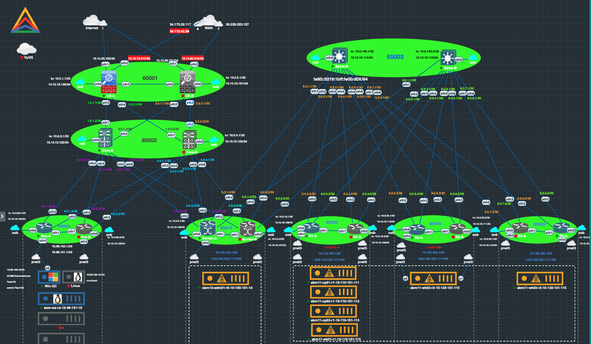
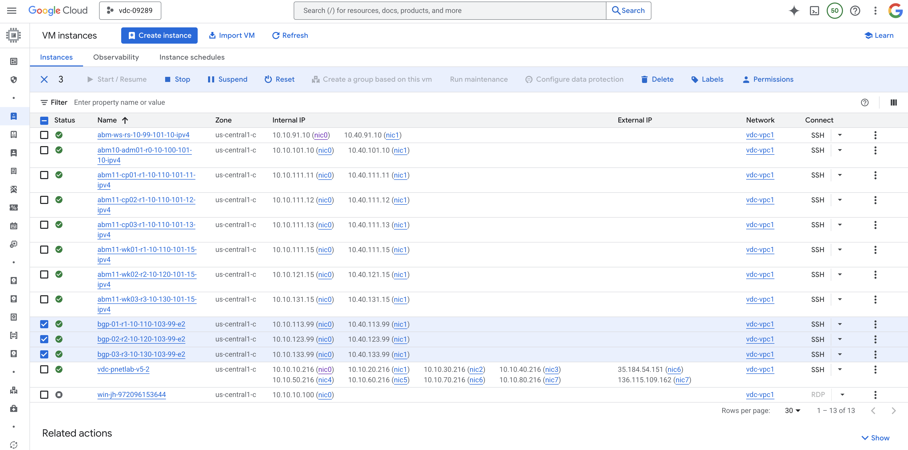

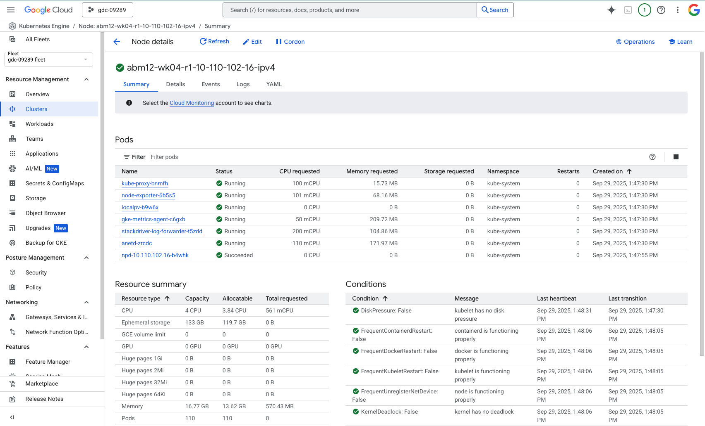


This lab creates a comprehensive virtual networking and datacenter infrastructure simulation environment on Google Cloud Platform. It was initially created for the purpose of testing and gaining hands-on experience with GDC Bare metal, but also to serve as a virtual on-premises environment for other hybrid cloud networking use cases.

This current git repo provides scripts and terraform files that automate the deployment of:

1. A **Network-appliance-based Datacenter fabric** - A KVM-based network simulation platform with a topology management interface to set up a datacenter network topology. This is deployed on an ubuntu GCE instance in project 'vdc-X' where X is a 6-digit random suffix created at runtime.
2. **Virtual Server Infrastructure** - Simulating physical data center servers across multiple racks for the purpose of running GDC s/o on. These servers mostly consist of of n2-standard GCE instances that plug into the aforementioned virtual network topology.
3. **A Fleet host project** The GCP project (gdc-X) for the GDC clusters to register to.
4. **Google Distributed Cloud (GDC) s/o Bare Metal clusters**: Pre-configured yaml cluster manifests to deploy 1 admin cluster that manages 2 users clusters: 1 with bundled Load balancing in L2 mode and 1 with bundled load balancing with BGP.

The purpose of this project was 3-fold:
- Provide a virtual  data center emulation environment akin to what customers run on-premises to emulate how customers truly establish hybrid cloud connectivity with Google Cloud solutions.
- Provide Google CEs, PSO, and Engineering an environment that they can use to learn, test, demo GDC with.
- Provide an experimentation sandbox for other GDC and hybrid cloud use cases.


## Project Content

The below tree structure provides a navigation map to the content of the repo (review optional):

```
vdc-lab-user-vdc-tmp/
├── main.sh                           # Main setup script (prerequisite automation)
├── main.tf                          # Core vDC infrastructure deployment
├── terraform.tfvars                 # Variables for vDC infrastructure
├── variables.tf                     # Variable definitions
├── main-crd-update.sh               # CRD update script
├── README.md                        # Landing page readme for git repo
├── README-main-tf.md                # main.tf documentation
├── README-serversTfing.md           # Servers terraform documentation
├── terraform.tfvars.tpl             # Template for terraform variables
├── .gitignore                       # Git ignore file
├── .gitattributes                   # Git attributes file
├── .terraform.lock.hcl              # Terraform lock file
├── 
├── gdc-gcp-project/                 # GDC Fleet Project Deployment
│   ├── README.md                    # GDC project documentation
│   └── tf/                          # GDC terraform configuration
│       ├── main-gdc.tf              # GDC project creation & service accounts
│       ├── terraform-gdc.auto.tfvars # GDC-specific variables
│       ├── terraform-gdc.auto.tfvars.tpl # GDC variables template
│       ├── variables-gdc.tf         # GDC variable definitions
│       ├── .gitignore               # GDC-specific git ignore
│       ├── SA-keys/                 # SA keys directory (generated by main.tf 
│       └── scripts/                 # GDC validation scripts
│           ├── validate_compute_policies.sh
│           └── validate_policy_active.sh
├── 
├── servers/                         # Server Infrastructure Deployment
│   ├── ref-bash-scripts/            # Reference bash scripts (legacy)
│   │   ├── 00-template-flex-dhcpfix.sh
│   │   ├── 01-servers-bgp.sh
│   │   ├── 01-servers-ws.sh
│   │   ├── 02-servers-admin.sh
│   │   ├── 03-servers-user1.sh
│   │   ├── 04-abm-adm1-107.yaml
│   │   ├── 05-abm-user1-107.yaml
│   │   ├── 99-delete-nodes.sh
│   │   └── readme.md
│   └── tf/                          # Server terraform configuration
│       ├── main-servers.tf          # Server deployment logic
│       ├── data.tf                  # Data sources for server deployment
│       ├── locals.tf                # Local values
│       ├── variables.tf             # Server variable definitions
│       ├── terraform-servers.auto.tfvars # Server configuration list
│       ├── startup-script-new.tpl   # Server startup script template
│       ├── shutdown-script.tpl      # Server shutdown script template
│       ├── README.md                # Server terraform documentation
│       ├── README-service-account-keys.md # SA keys documentation
│       ├── .terraform.lock.hcl      # Terraform lock file
│       ├── deployed-vms-*.txt       # Deployment tracking files
│       ├── templates/               # Script templates for server configuration
│       │   ├── 01-network-setup.sh.tpl
│       │   ├── 02-pnet-server-fdb-add.sh.tpl
│       │   ├── 04-tools.sh.tpl
│       │   ├── 05-bgp-sa-config.sh.tpl
│       │   ├── 05-workstation-sa-config.sh.tpl
│       │   ├── 06-workstation-helpers.sh.tpl
│       │   ├── 07-bgp-helpers.sh.tpl
│       │   └── 99-shutdown-cleanup.sh.tpl
│       └── generated-scripts/       # Generated server-specific scripts
│           ├── abm-ws-rs-*/         # Workstation server scripts
│           ├── abm10-adm01-*/       # Admin cluster scripts
│           ├── abm11-*/             # User1 cluster scripts
│           ├── abm12-*/             # User2 cluster scripts
│           └── bgp-*/               # BGP router scripts
├── 
├── manifests/                       # Kubernetes/GDC manifests
│   ├── abm10-adm01.yaml            # Anthos Bare Metal admin cluster configuration
│   ├── abm11-user1.yaml            # Anthos Bare Metal user1 cluster configuration
│   └── abm12-user2.yaml            # Anthos Bare Metal user2 cluster configuration
├── 
├── assets-pnetlab/                  # PNetLab assets and configurations
│   ├── pnet-install-on-gcp.txt     # PNetLab installation guide
│   ├── custom-images/               # Custom VM images
│   ├── iso/                         # ISO files
│   ├── net-fix-scripts-pnetlab/     # Network fix scripts
│   ├── opt/                         # Optional configurations
│   ├── qemu-bkp/                    # QEMU backups
│   └── vyos-configs/                # VyOS router configurations
├── 
├── assets-jump-host/                # Windows jump host configuration
│   ├── crd-auth-command.txt         # CRD authentication command
│   ├── crd-sysprep-script.ps1       # Windows sysprep script
│   └── scripts/                     # Jump host scripts
│       ├── append-script.ps1
│       ├── get_crd_auth.sh
│       ├── sysprep.sh
│       ├── windows_startup.ps1.old
│       └── wrapper.sh
├── 
├── GDC-Lab-Guide/                   # Lab documentation and guides
│   ├── LabGuide.md                  # Main lab guide
│   └── LabGuide-assets/             # Lab guide images and assets
│       └── [multiple PNG files]     # Screenshot assets
├── 
├── main-info/                       # Additional project information
│   └── pnet_image_sourced.txt       # PNet image source information
├── 
└── scripts/                         # Utility scripts
    └── validate_compute_policies.sh # Compute policy validation script

```

## Copyright

<a rel="license" href="http://creativecommons.org/licenses/by-nc-sa/4.0/"></a><br />This work is licensed under a <a rel="license" href="http://creativecommons.org/licenses/by-nc-sa/4.0/">Creative Commons Attribution-NonCommercial-ShareAlike 4.0 International License</a>.


## Lab Guides

The advanced/deep-dive lab guide is located at [GDC-Lab-Guide/LabGuide.md](https://gitlab.com/ymeillier/vdc-lab-user/-/blob/main/GDC-Lab-Guide/LabGuide.md).

Below is a fast track version of the lab guide that covers the key steps required to deploy the lab without getting into the details provided by the advanced lab guide

# Accelerated Lab Deployment Guide


The accelerated lab guide is the landing page readme file of the repo `https://github.com/ymeillier/vdc-gdc-lab-user/tree/main#`

Use the specific readme file link to leverage the github TOC/Navigation pane:
```
https://github.com/ymeillier/vdc-gdc-lab-user/blob/main/README.md
```

This lab goes through 4 main steps:
- 1/Run main.sh to setup key variables for your deployment. This will
	- define the variables
	- deploy the virtual datacenter infrastructure via a terraform apply of main.tf
	- deploy the GDC GCP project via a terraform apply on ./gdc-gcp-project/tf/main-gdc.tf
- 2/ start the network topology virtual routers and domain controller.
- 3/ deploy servers for GDC: configure servers to be deployed via ./servers/tf/terraform-servers.auto.tfvars) and terraform apply on main-servers.tf
- 4/ deploy GDC cluster using clusters manifest on the workstation appliance.

## Pre-Requisites

You need to reach out to Yannick Meillier (meillier@) for your user account and google workspace ID to be whitelisted.

For the Google Workspace ID (for the org admin user profile):
     - Sign in to the Google Admin console at admin.google.com.
     - Navigate to the Menu: Account > Account settings > Profile.
     - Look for the Customer ID field. This is your organization's unique GWCID.

## Step 1 - Deploy the virtual network topology & GCP Fleet Project

In cloud shell or your local IDE, clone the repo in a location of your choice:

```
git clone https://github.com/ymeillier/vdc-gdc-lab-user.git
```
and cd into the git repo:
```
cd vdc-lab-user
```

Run the deployment bash script main.sh and follow the prompts:

```
./main.sh
```

Answer the questions as the script goes through its different stages. This lab is meant to be deployed by a user who has org admin role on your GCP organization. In argolis, our internal CE GCP environment, this would normally be admin@user.altostrat.com where user is your Argolis username.


## Step 2 - Start the nodes of the virtual network topology

You have two options to access the pnetlab server web interface:
- via a port forwarding ssh tunnel
- via the windows jump host 

Port forwarding will not work from cloud Shell because of some complex http redirects sent by site. The recommendation is to use your own local terminal with the gcloud sdk installed to setup port forwarding with

```
gcloud compute ssh root@vdc-pnetlab-v5-2 --tunnel-through-iap -- -Nf -L 8080:10.10.10.216:443
```

then access the web page via localhost on port 8080:
```
[https://localhost:8080](https://localhost:8080)
```

Log in using credentials displayed in the page (admin/pnet)

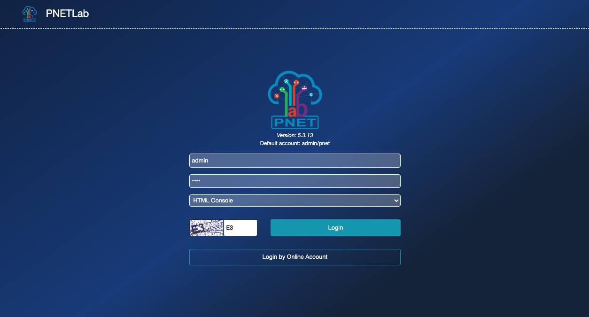


pick the lab '02LeafSpinev1' from the list (click on the name of the lab itself to show the preview) and then 'Open':


The network fabric is managed by a number of vyos devices that are to be powered on one by one. Not all nodes will powered on though. Only power on the following nodes:
- CE-A
- Core-A
- Svc-A
- Border-A
- R1-A
- R2-A
- R3-B (on rack 3 the B-side of the pair of TORs is the one configured)
- Spine-A
- Spine-B 
- win-DC qemu appliance (dns server)

Validate connectivity to the internet. Single click on any node to access their terminal. vyos nodes all use the same username/password (vyos/vyos) while the win-DC appliance, which you do not need to log into unless you wanted to create custom dns entries/lookup-zones, has its credentials provided in the topology. 

In the below example we login to R3-B to test connectivity to the internet and to validate dns resolutions
- ping 8.8.8.8
- ping google.com
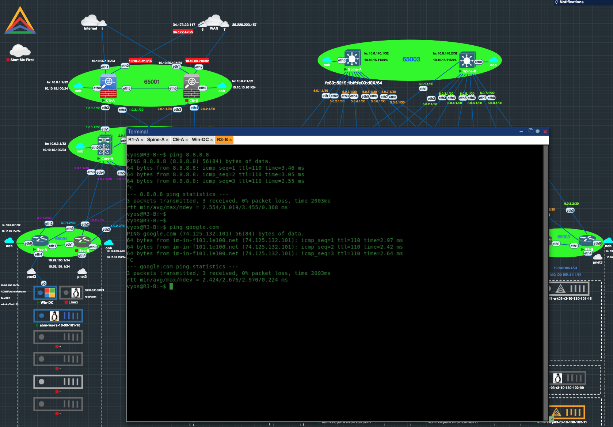


!! Important
If connectivity fails, go verify that the pnetlab server startup script that customize the network stack ran. See the advanced lab guide, end of section 1.4.


## Step 3 - Deploy Servers

Servers are deployed using the /servers/main-servers.tf terraform configuration file.

The servers to be deployed (which rack, which vlan, which type) are specified in the `terraform-servers.auto.tfvars` terraform variables file.
In our case a server to act as our admin workstation, a server to be our single-node admin cluster server, nodes for the L2 GDC cluster and nodes for the L3-BGP cluster.

Deploy the servers doing a terraform apply while in /servers/tf/:

```
cd /servers/tf
terraform apply
```


## Step 4 - Create Admin cluster

SSH into the admin workstation. Either via the SSH hyperlink of the cloud console to open a new tab/window or via the terminal

```
gcloud compute ssh abm-ws-10-99-101-10-ipv4 --tunnel-through-iap
```


Authenticate as your admin account:
```
glcoud auth login --update-adc
```

and update ADCs:
```
gcloud auth application-default login
```


As root go to `/home/baremetal/`

```
sudo -i 
cd /home/baremetal
```

Create the configs for the admin cluster:

```
ADMIN_CLUSTER_NAME=abm10-adm01
FLEET_PROJECT_ID=gdc-09289
bmctl create config -c $ADMIN_CLUSTER_NAME --project-id=$FLEET_PROJECT_ID

```
*Replace the 6 digit number of gdc-xxxxxx with your own.


Note: If you run into an issue with bmctl not being available, it is because the version that the startup script uses is no longer available. You can download it again, here with 1.32.400-gke.68. (for versions, see (see https://cloud.google.com/kubernetes-engine/distributed-cloud/bare-metal/docs/downloads#download_bmctl):

```
cd /home/baremetal
BMCTL_VERSION='1.32.400-gke.68'
sudo gsutil cp gs://anthos-baremetal-release/bmctl/${BMCTL_VERSION}/linux-amd64/bmctl .
sudo chmod a+x bmctl
sudo mv bmctl /usr/local/sbin/
```


The cloned repo provides manifests for all clusters in the /manifests directory:
- abm10-adm01.yaml
- abm11-user1.yaml
- abm12-user2.yaml


The yaml created by the bmctl command in the `bmctl-workspace/abm10-adm01` directory as well as the other clusters' manifests  will be replaced with the ones from our repo.


First before transferring the files to our workstation, update the project ID references therein with the ones from your environment.


From your terminal/cloud-shell. We will first have to scp the file to the user home folder and then move it to the bmctl-workspace folder. 

```
gcloud compute scp ./manifests/*.yaml abm-ws-rs-10-99-101-10-ipv4:~ --tunnel-through-iap 
```
and in the workstation appliance:

```
mv /home/admin_meillier_altostrat_com/abm10-adm01.yaml bmctl-workspace/abm10-adm01/
```

and change the file ownership to that of root (who technically created the files):
```
sudo chown root:root bmctl-workspace/abm10-adm01/abm10-adm01.yaml
```


Create the cluster:

```
bmctl create cluster -c abm10-adm01
```


Create rbac permission for your user. On the admin workstation

```
GOOGLE_ACCOUNT_EMAIL=admin@meillier.altostrat.com
CLUSTER_NAME=abm10-adm01
PROJECT_ID=gdc-09289
export KUBECONFIG=/home/baremetal/bmctl-workspace/$CLUSTER_NAME/$CLUSTER_NAME-kubeconfig
export CONTEXT="$(kubectl config current-context)"
```


```
gcloud container fleet memberships generate-gateway-rbac \
--membership=$CLUSTER_NAME \
--role=clusterrole/cluster-admin \
--users=$GOOGLE_ACCOUNT_EMAIL \
--project=$PROJECT_ID \
--kubeconfig=$KUBECONFIG \
--context=$CONTEXT \
--apply
```

Note: there is a way to avoid having to do that for every new cluster. We will use the other method with our user clusters.


The cluster will register itself to the GDC project:

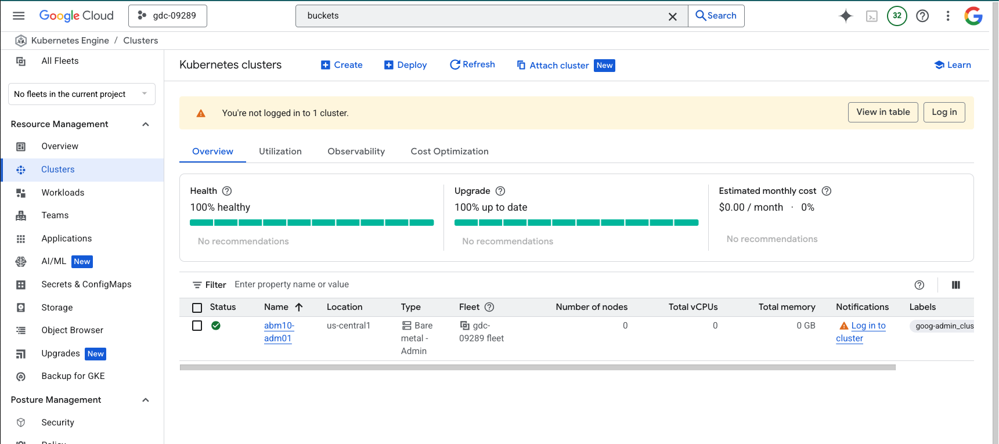

You can use your Google Identity to login in the console.
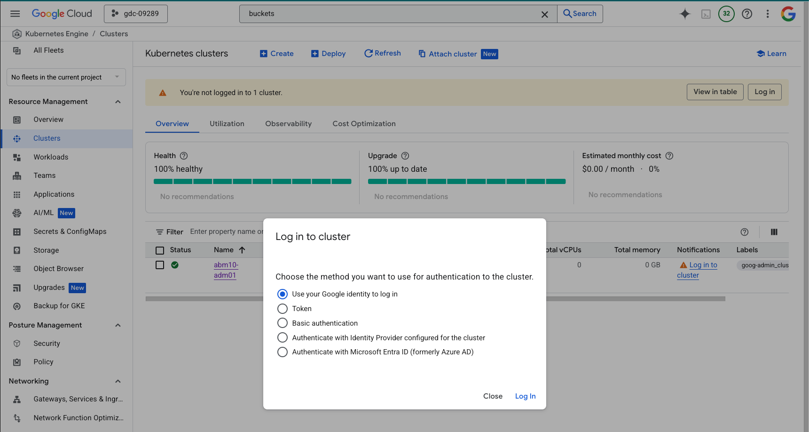


In cloud shell or your terminal, confirm the fleet and cluster membership via:

```
gcloud container fleet memberships list --project gdc-09289
```

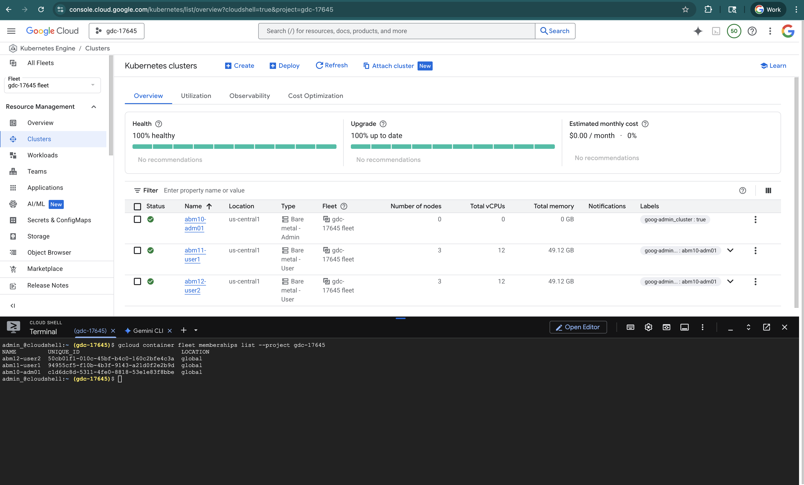


Get your kubernetes credentials:
```
gcloud container fleet memberships get-credentials abm10-adm01
```

and from there you can perform kubectl commands. For example 

```
kubectl get nodes -o wide
```


## Step 5 - Deploy L2 User Cluster


For the L2 based user cluster we will use the nodes from rack 1, 2, and 3 deployed earlier with all 3 control planes deployed to Rack-1 because of the L2 adjacency requirements.


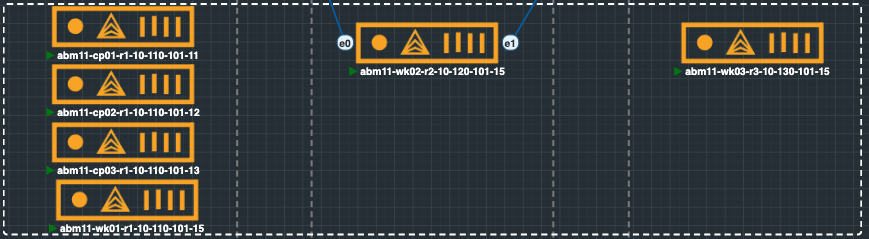

On the admin workstation, while in `/home/baremetal`, create the config for the new cluster:

```
bmctl create config -c abm11-user1
```

As we did above for the admin cluster, fetch the cluster manifest from our repo:

 ```
 gcloud compute scp ./abm11-user1.yaml root@abm-ws-rs-10-99-101-10-ipv4:~
 ```
 and on the workstation relocate the manifest to its proper location:

 ```
 mv /home/admin_meillier_altostrat_com/abm11-user1.yaml /home/baremetal/bmctl-workspace/abm11-user1/
 ```

 The admin cluster is now responsible for create that user cluster whereas before, a kind cluster hosted on the workstation was handling the creation of the admin cluster.

 So setup the kubeconfig to be the .kubeconfig of the admin cluster (on the workstation) and create the user cluster:

 ```
KUBECONFIG=bmctl-workspace/abm10-adm01/abm10-adm01-kubeconfig
bmctl create cluster -c abm11-user1 --kubeconfig $KUBECONFIG
```


This cluster manifest uses the cluster security resource to automatically grant the user specified therein admin access to the cluster:

```
clusterSecurity:
  authorization:
    clusterAdmin:
      gcpAccounts:
      - admin@meillier.altostrat.com
```


From cloudshell, auth into the cluster and validate kubectl access:

```
gcloud container fleet memberships get-credentials abm11-user1
kubectl get nodes -o wide
```

We will first deploy a test aoo to show how an ip from our services range is consumed by the App's exposed service.


We'll use the sample app from the doucmentation ([https://cloud.google.com/kubernetes-engine/distributed-cloud/bare-metal/docs/how-to/deploy-app#create_a_deployment](https://cloud.google.com/kubernetes-engine/distributed-cloud/bare-metal/docs/how-to/deploy-app#create_a_deployment))

```
cat << EOF > my-deployment.yaml
apiVersion: apps/v1
kind: Deployment
metadata:
  name: my-deployment
spec:
  selector:
    matchLabels:
      app: metrics
      department: sales
  replicas: 3
  template:
    metadata:
      labels:
        app: metrics
        department: sales
    spec:
      containers:
      - name: hello
        image: "us-docker.pkg.dev/google-samples/containers/gke/hello-app:2.0"
EOF
```

```
kubectl apply -f my-deployment.yaml
```
and the service of type LoadBalancer:
```

cat << EOF > my-service.yaml
apiVersion: v1
kind: Service
metadata:
  name: my-service
spec:
  selector:
    app: metrics
    department: sales
  type: LoadBalancer
  ports:
  - port: 80
    targetPort: 8080
EOF
```

```
kubectl apply -f my-service.yaml
```


View the service and its assigned load balancer ip:
```
kubectl get service my-service --output yaml
```


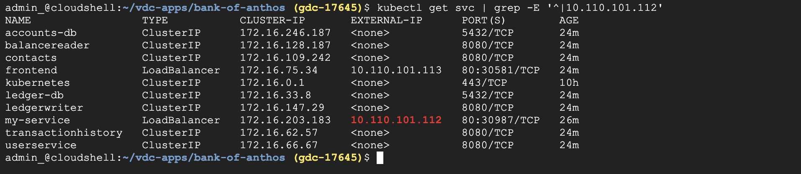


We can curl the service from any client external to the cluster, for example the CE-A router:
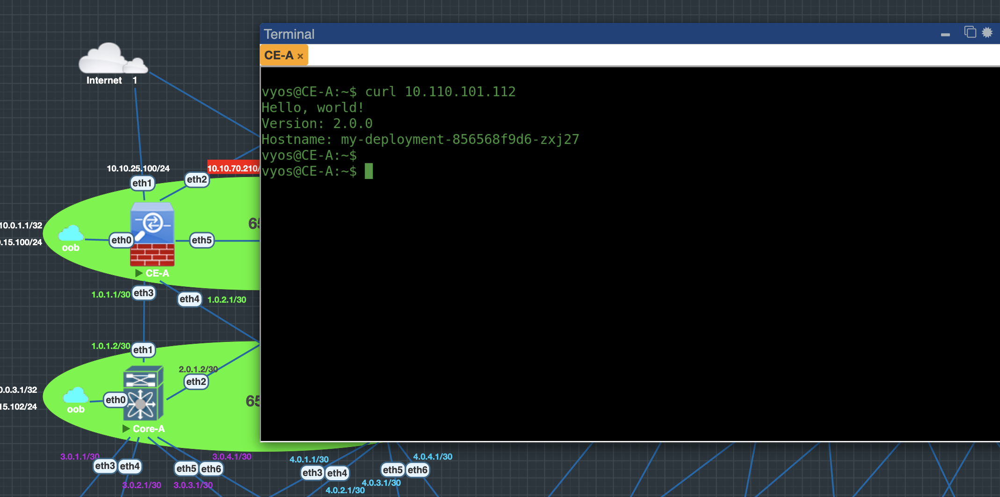

TOR-A on Rack1 learns the mac address advertised for the service's Load balancer IP (10.110.111.112):
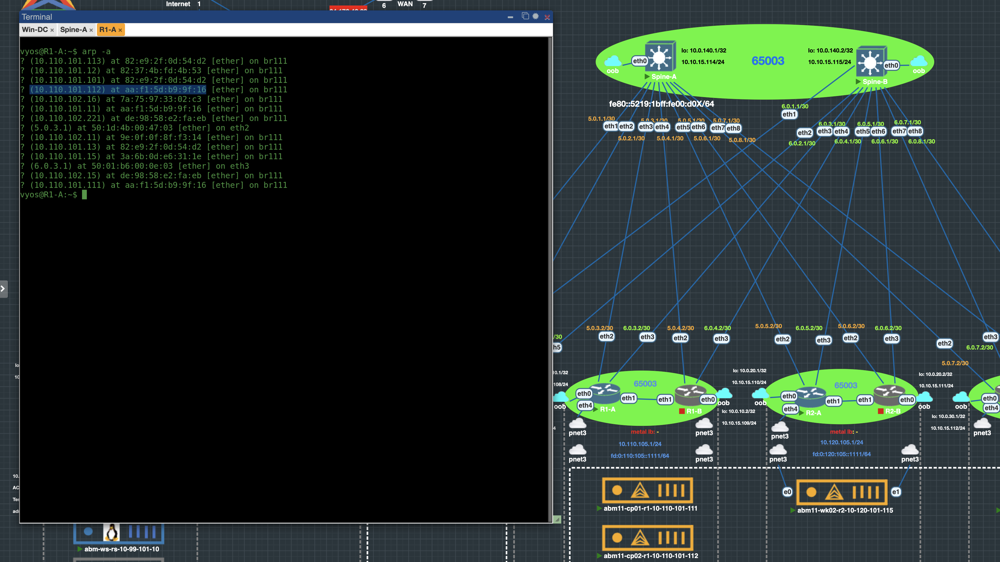


The mac address associated with our vip is that of node CP01:
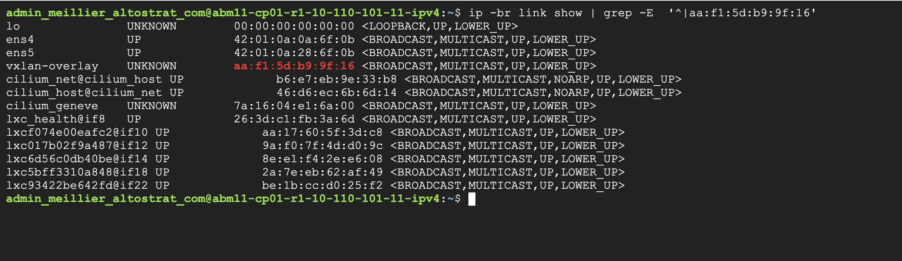

The vip is advertised by the metallb speaker pod on that node (there is one per node):
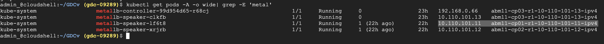
This is why, unlike the CP VIP, the vip is not assigned to the node interface:

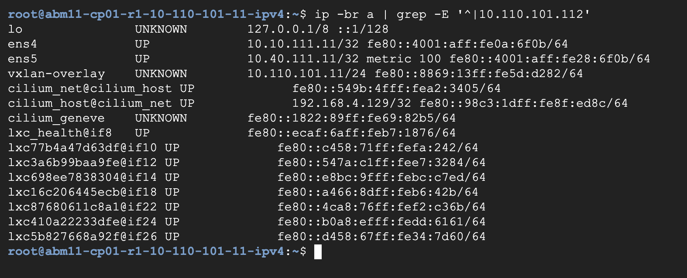

Events for the service would show which metallb pod will get the vip assigned to it:
```
kubectl describe svc/my-service
```
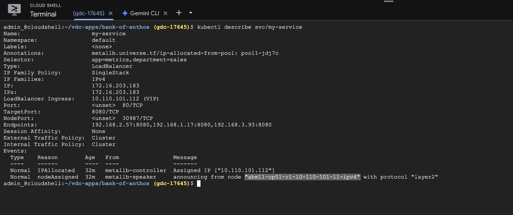

The below slide further explains the architecture of bundled LB L2 mode with metalLB for dataplane traffic:
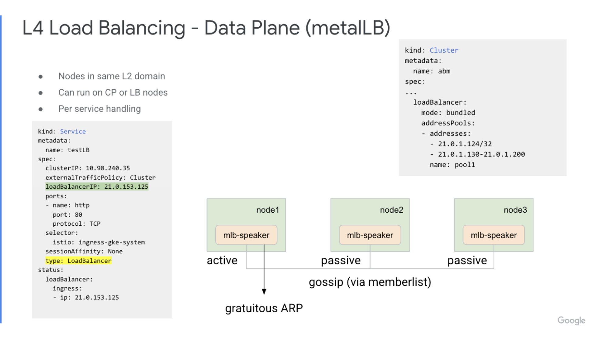


We will deploy another app on that cluster , one that can be browsed to via our windows instance (win-DC). We use the bank of Anthos microservices app from 
https://github.com/GoogleCloudPlatform/bank-of-anthos


We deploy the bank of anthos microservices app from [https://github.com/GoogleCloudPlatform/bank-of-anthos](https://github.com/GoogleCloudPlatform/bank-of-anthos)

From cloud shell:
```
git clone https://github.com/GoogleCloudPlatform/bank-of-anthos
cd bank-of-anthos/
```

Make sure you are authenticated against the user cluster:

```
gcloud container fleet memberships get-credentials abm11-user1
```

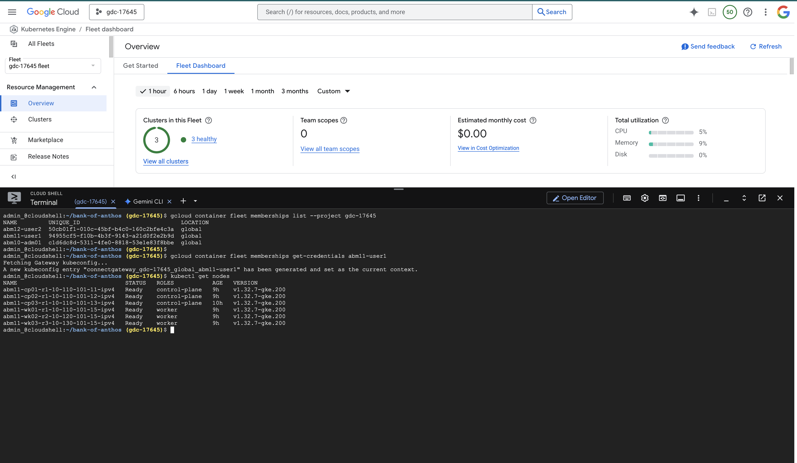


Deploy Bank of Anthos to the cluster.
    
    ```shell
    kubectl apply -f ./extras/jwt/jwt-secret.yaml
    kubectl apply -f ./kubernetes-manifests
    ```

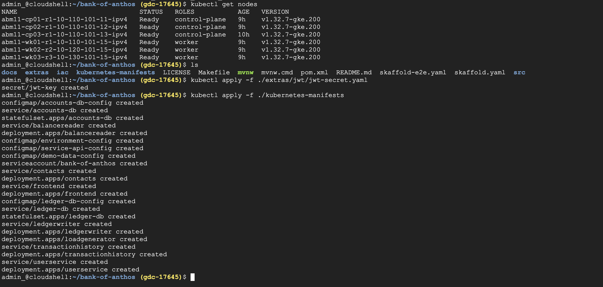

```
kubectl get pods -o wide
```


```
kubectl get svc
```

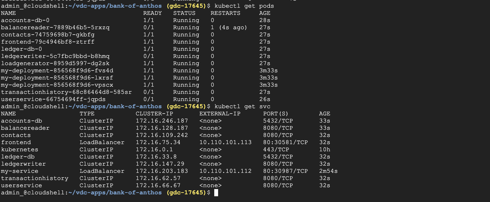
we can see the fronted exposed service consume the ip 10.110.101.113 from our services range while 10.110.101.112 is used by the test app we deployed in that previous step.

Once again service IPs can only be provisioned from the services range on Rack-1's vlan 101 .

we can connect to the app internally via the win-DC windows instance:

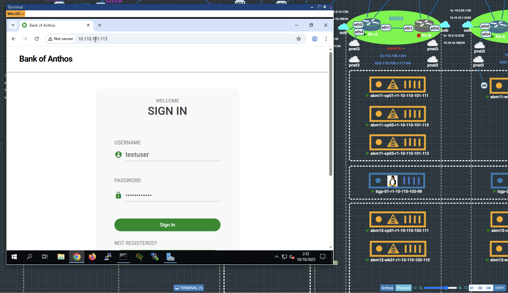

the mac address assciated to our vip is learned on the top of rack swicth:
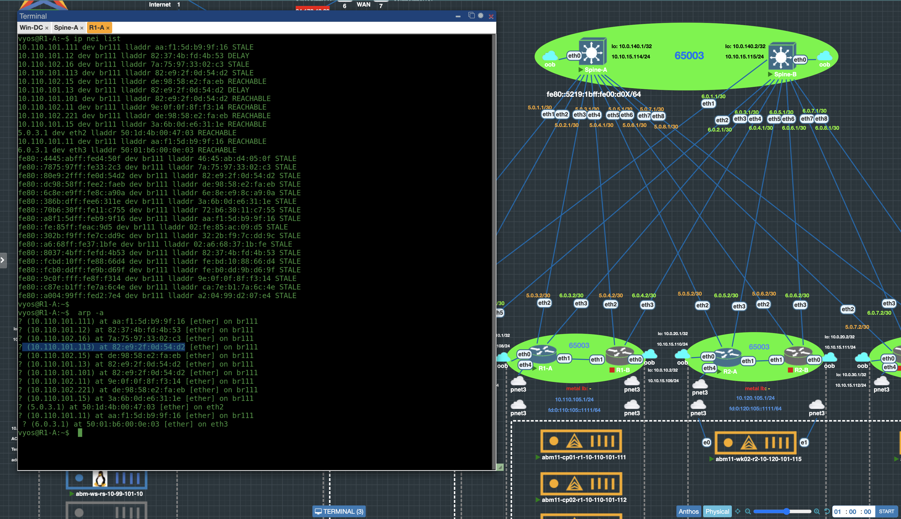

`82:e9:2f:0d:54:d2` happens to be the mac address of cp node 3:
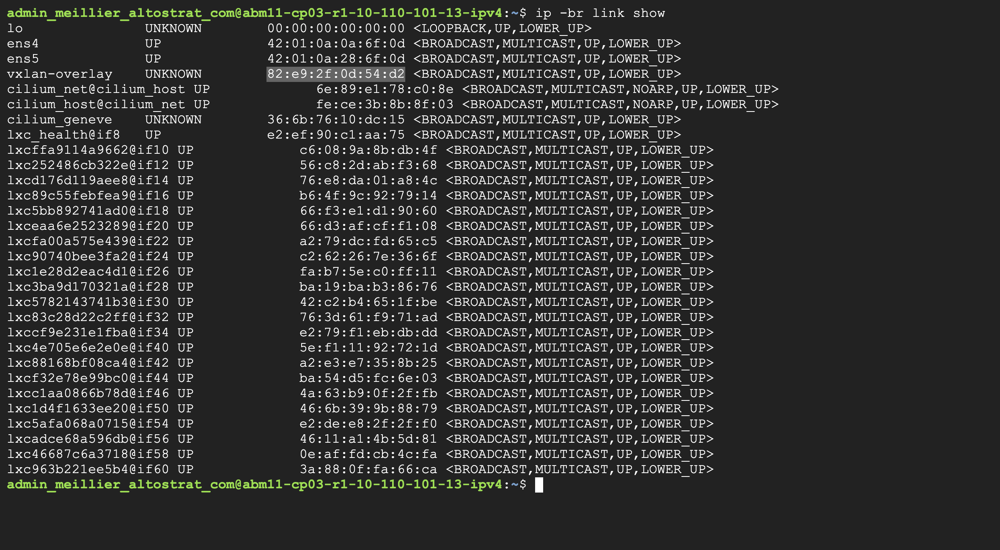

We could also have done a describe on the service to find out which metallb pod (and thus node since there is one such metallb advertiser per node) handles that service:

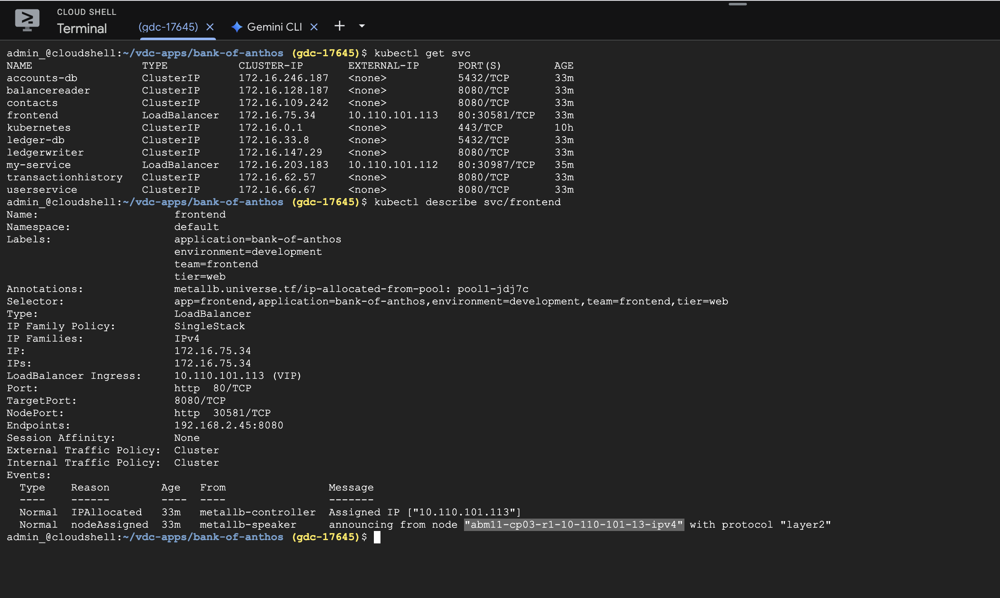


The previous app, which was exposed via vip 10.110.101.112, is exposed by  cp01:

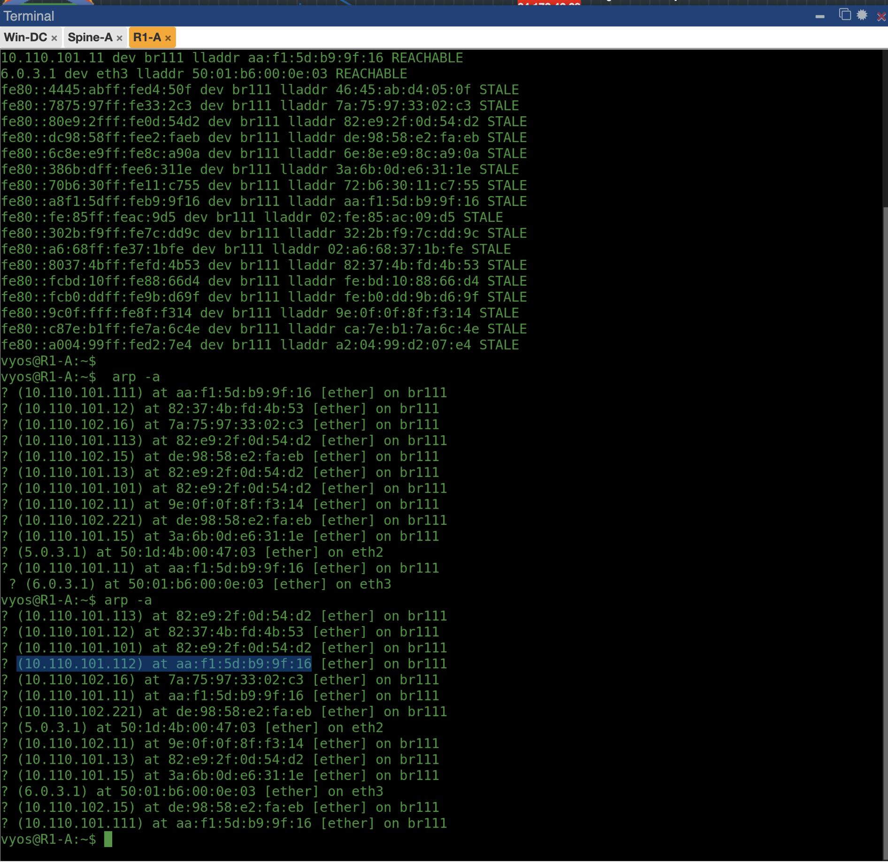
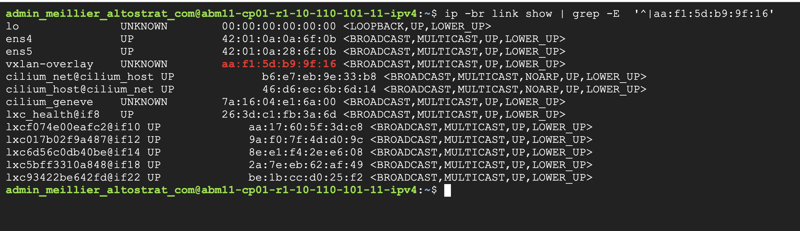
GDC metalLB round robins vip assigned across the load balancer nodes (CP nodes by default).


 
## Step 6 - Deploy L3 User Cluster

The L3 cluster uses BGP connectivity to the fabric to expose its control plane and services/app vips and as such provides a lot more freedom on how the cluster can be architecture for enhanced resiliency/availability as well as throuhput.

Again the process is the same as for the L2 cluster.

On the workstation:
```
cd /home/baremetal/
bmctl create config -c abm12-user2
```

From your local repo, via cloud shell or your terminal, replace the manifest with our pre-populated manifest:

```
gcloud compute scp ./abm12-user2.yaml root@abm-ws-rs-10-99-101-10-ipv4:~
```


and on the workstation:
```
mv /home/admin_meillier_altostrat_com/abm12-user2.yaml /home/baremetal/bmctl-workspace/abm12-user2/
KUBECONFIG=bmctl-workspace/abm10-adm01/abm10-adm01-kubeconfig
bmctl create cluster -c abm12-user2 --kubeconfig $KUBECONFIG
```


We now deploy the cymbal shop app.

We will deploy a different app to our L3 cluster:[] https://github.com/GoogleCloudPlatform/microservices-demo](https://github.com/GoogleCloudPlatform/microservices-demo)


First we authenticate back our L3 cluster:

```
gcloud container fleet memberships get-credentials abm12-user
```


```
git clone --depth 1 --branch v0 https://github.com/GoogleCloudPlatform/microservices-demo.git
cd microservices-demo/
```

and deploy with:

```
kubectl apply -f ./release/kubernetes-manifests.yaml
```


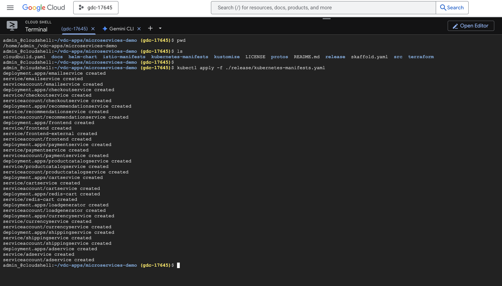
```
kubectl get pods -o wide
```

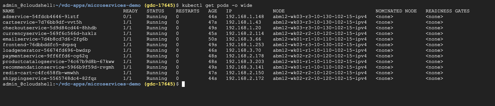
```
kubectl get svc
```


we can see that our exposed service leverages ip 10.212.102.112. This is a floating ip advertised to the BGP peers set for the cluster.

On the Spine-A swtich we can show bgp routing table:

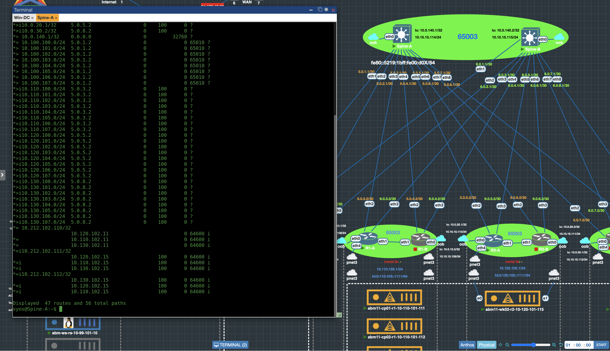

The routing table shows that ip 10.212.102.112 is availabe via the next hop IPs 10.110.102.15, 10.120.102.15, and 10.130.102.15.  Those are the three work nodes of our cluster. The network fabric will thus be able to ECMP across those 3 next hops each new request, providing efficient load balancing across our 3 nodes, providing more resiliency against rack failure and increasing throughput to our app.

We can browse to the service IP via our windows domain controller node:

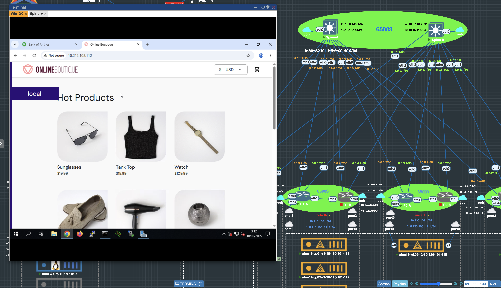

## Step 7 - Cleanup

To cleanup asssets from your environment do a terraform destroy from each in reversed order:

Relative to your local project root directory: 
```
cd gdc-gcp-project/tf/
terraform destroy
```

```
cd servers/tf/
terraform destroy
```

and on your main project root directory (where main.tf )
```
cd ./
terraform destroy
```
